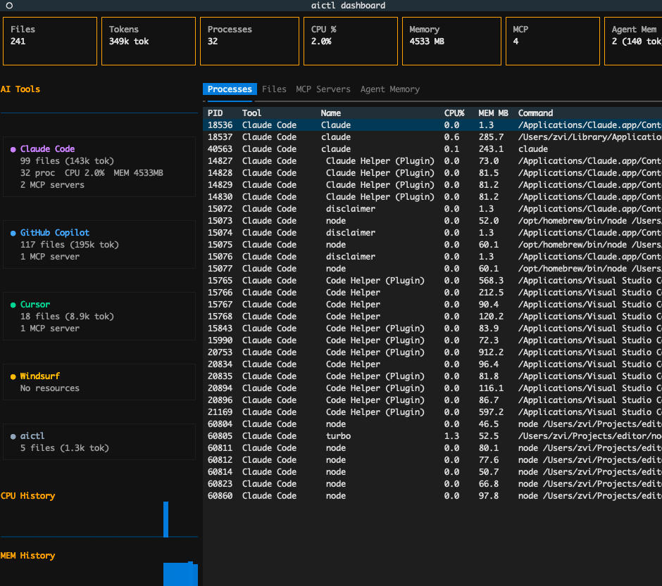

# aictl — AI Context from `.aictx` Files

AI coding tools accumulate project knowledge in incompatible, scattered formats — instruction files, MCP configs, hooks, memory entries, agent definitions — each duplicated per tool and invisible to the others. The knowledge is the same; only the packaging differs.

`.aictx` is a single, declarative format for **project-specific and mode-specific AI knowledge**. One file captures everything an AI tool needs to understand about a codebase: instructions, commands, skills, MCP servers, LSP servers, hooks, and scoped rules. Profiles let you maintain distinct operational modes — debugging, documentation, review — each with its own context and agent memory.

**`aictl`** is the control plane that bridges `.aictx` to the real world:

- **Deploy** — translate `.aictx` into native files for Claude Code, GitHub Copilot, Cursor, and Windsurf, with profile-aware memory swap on every switch
- **Import** — reverse-generate `.aictx` templates from existing native files, so nothing already written is lost
- **Audit** — scan a project for every AI resource across all tools: config files, hidden state directories, memory entries, MCP servers, running processes, and their resource consumption
- **Visualize** — a live web dashboard with file content inspection, a terminal TUI, and a self-contained HTML report
- **Package** — bundle `.aictx` into distributable Claude Code plugins

Runs on **macOS, Windows, and Linux**.


*Live web dashboard (`aictl serve`) — overview showing all discovered AI tools as collapsible cards sorted by resource weight. Stat cards show total files, tokens, processes, CPU, memory, and MCP servers across 27+ tools. Real-time updates via SSE.*


*Expanded tool card — files grouped by category (instructions, config, rules, commands, memory) with collapsible directory nodes. Click any file for inline content preview with line numbers. Processes shown with visual memory bars and anomaly detection.*



*Terminal dashboard (`aictl dashboard`) — stat cards, per-tool summaries, sparkline CPU/MEM history, and tabbed views for processes, files, MCP servers, and agent memory.*

## Install

Install globally with [pipx](https://pipx.pypa.io) (recommended — keeps `aictl` isolated from other Python projects):

```bash
# Full install: CLI + web dashboard + TUI + process detection
pipx install --force ".[all]"

# Core CLI only (includes web dashboard — no extra deps needed)
pipx install .
```

> **After updating source code**, you must reinstall for the `aictl` command to pick up changes:
> ```bash
> pipx install --force -e ".[all]"   # editable + all extras
> ```

### Get pipx

**macOS**
```bash
brew install pipx && pipx ensurepath
```

**Windows** (PowerShell)
```powershell
python -m pip install pipx
python -m pipx ensurepath
# Then restart your terminal so PATH takes effect
```

**Linux**
```bash
pip install --user pipx && pipx ensurepath
```

### Optional extras

The web dashboard (`aictl serve`) works with zero extra dependencies. For the TUI and process detection:

| Extra | Installs | When to use |
|-------|----------|-------------|
| `.[dashboard]` | `textual` | Terminal TUI dashboard (`aictl dashboard`) |
| `.[processes]` | `psutil` | Cross-platform process detection |
| `.[monitor]` | `psutil`, `watchdog` | Live observability (`aictl monitor`) |
| `.[all]` | `textual`, `psutil`, `watchdog` | Recommended for full functionality |

```bash
# Add an extra to an existing install
pipx inject aictl psutil
pipx inject aictl textual
pipx inject aictl watchdog
```

> **Without `psutil`:** process detection falls back to `ps` on macOS/Linux and is silently skipped on Windows.

### Development install

```bash
# If using pipx (recommended — keeps the `aictl` command working):
pipx install --force -e ".[all]"

# Or plain pip (won't update the pipx-installed `aictl` command):
pip install -e ".[all]"
```

> **Tip:** If you get `No such command 'serve'` after pulling new code, run `pipx install --force -e ".[all]"` to re-register all commands.

## How It Works

### Deploy: `.aictx` → native tool files

```
my-project/
├── .context.aictx                    ← root: instructions + commands + skills + MCP + hooks + LSP
├── services/ingestion/.context.aictx ← sub-scope: scoped instructions
└── services/query-engine/.context.aictx
```

```bash
aictl deploy --root my-project/ --profile debug
```

Generates all native files at the root:

```
my-project/
├── CLAUDE.md                         ← Claude Code base instructions
├── CLAUDE.local.md                   ← profile + agent overlay
├── .claude/rules/services-ingestion.md  ← scoped (glob-matched)
├── .claude/commands/investigate.md   ← slash command
├── .claude/skills/flame-graph/SKILL.md
├── .mcp.json                         ← MCP servers
├── .lsp.json                         ← LSP servers (for plugins)
├── .claude/settings.local.json       ← lifecycle hooks
├── .github/copilot-instructions.md   ← Copilot repo-wide
├── .github/agents/debugger.agent.md  ← Copilot agent
├── .github/prompts/investigate.prompt.md ← VS Code prompt file
├── .cursor/rules/base.mdc            ← Cursor rule
├── .cursor/rules/profile-active.mdc
├── AGENTS.md                         ← Copilot/Cursor profile
└── .ai-deployed/manifest.json        ← tracks files for cleanup
```

Switch profile — old files removed, new files created, memory swapped:

```bash
aictl deploy --root my-project/ --profile docs
```

### Import: native tool files → `.aictx`

Already have `CLAUDE.md`, `.github/copilot-instructions.md`, or `.cursor/rules/`? Import them into `.aictx` format:

```bash
aictl import --root my-project/
```

Reads native files from all detected tools and generates `.context.aictx` files at each relevant directory level:

```
my-project/
├── .context.aictx                    ← reconstructed from CLAUDE.md, copilot-instructions.md, etc.
├── services/ingestion/.context.aictx ← reconstructed from scoped rules
└── services/query-engine/.context.aictx
```

Works with both aictl-generated files (strips deployment markers) and hand-written files. When multiple tools have overlapping content, use `--prefer` to pick the authoritative source:

```bash
aictl import --root . --prefer claude
```

Running `aictl deploy` on the imported `.aictx` files reproduces the original native files.

### Plugin: package as a Claude Code plugin

Build a distributable Claude Code plugin from your `.aictx` files:

```bash
aictl plugin build --root my-project/ --name my-plugin --profile debug
```

Generates a complete plugin structure:

```
my-project/plugin/
├── .claude-plugin/plugin.json   ← manifest
├── commands/investigate.md      ← slash commands
├── skills/flame-graph/SKILL.md  ← agent skills
├── agents/debugger.md           ← custom agents
├── hooks/hooks.json             ← lifecycle hooks
├── .mcp.json                    ← MCP servers
├── .lsp.json                    ← LSP servers
└── settings.json                ← default agent
```

Test locally with `claude --plugin-dir ./plugin`, then submit to the plugin marketplace.

### Status: see all AI tool resources

See every file, memory entry, MCP server, and running process across all tools in one view:

```bash
aictl status
```

Discovery is CSV-driven and covers 27+ tools. Use `--tool claude` to filter (expands to all Claude sub-tools), `--processes` for running processes with anomaly detection, `--budget` for token cost analysis, or `--json` for machine-readable output.

```bash
aictl status --processes          # include process detection
aictl status --budget             # token cost breakdown
aictl status --tool copilot       # filter to Copilot tools only
aictl status --json               # full JSON with enriched metadata
aictl status --backtrace 12345    # sample a process stack trace
```

### Monitor: live AI-tool observability

Run a passive, best-effort live monitor for active AI sessions:

```bash
aictl monitor live
```

It is designed for **macOS, Windows, and Linux** and focuses on:

- **VS Code Copilot** / editor-hosted Copilot activity
- **Claude Code**
- **Copilot CLI**
- **Codex CLI**

The monitor correlates:

- **process activity** via `psutil`
- **filesystem activity** via `watchdog`
- **network activity** through platform adapters
- **structured telemetry** when tools expose usage-like logs

It reports traffic, best-effort token estimates with confidence, MCP-style loop detection, and workspace context:

```bash
aictl monitor live --once
aictl monitor live --json
aictl monitor doctor
```

Notes:

- **macOS** uses a `nettop`-backed per-process adapter
- **Linux** uses `ss`/`tcpinfo` deltas as the current fallback path
- **Windows** currently uses a degraded connection-weighted fallback until ETW/WFP bindings are added
- token counts are **signals, not exact billing/accounting**

### Viewing: three ways to explore

aictl offers three complementary ways to view AI tool resources, from quick terminal checks to full interactive dashboards:

#### 1. Web Dashboard (`aictl serve`) — recommended for exploration

```bash
aictl serve                     # opens browser at http://127.0.0.1:8484
aictl serve --port 9000         # custom port
aictl serve --no-open           # don't auto-open browser
```

The web dashboard is a real-time, interactive interface that auto-updates via Server-Sent Events:

- **Overview-first** — all tools shown as collapsed summary cards in a grid. Each card shows file count, tokens, processes, MCP servers, and anomaly count at a glance. Click to expand.
- **Hierarchical files** — expanded tool cards group files by category (instructions, config, rules, commands, skills, memory, transcript). Each category is collapsible.
- **Inline file preview** — click any file to see content inline with line numbers. Small files show fully; large files show a tail preview with "show all (N lines)" to expand. "open in viewer" button for full slide-in panel.
- **Process monitoring** — dedicated Processes tab with all processes sorted by memory, visual memory bars, process type column, and anomaly icons with tooltips.
- **MCP server status** — connectivity table with live status indicators (green/red/orange dots).
- **Agent memory browser** — collapsible groups (User Memory, Project Memory, Auto Memory) with click-to-view content.
- **Token budget** — breakdown of always-loaded, on-demand, cacheable, and compaction-surviving tokens.
- **Dark/light mode** — auto-detects system preference.
- **No extra dependencies** — uses Python stdlib `http.server`.

REST API for scripting and integration:

```bash
curl http://localhost:8484/api/snapshot     # full JSON snapshot
curl "http://localhost:8484/api/file?path=/path/to/CLAUDE.md"  # file content
curl http://localhost:8484/api/budget       # token cost analysis
curl -N http://localhost:8484/api/stream    # real-time SSE stream
```

> The file API only serves files in the discovered resource set — arbitrary paths are rejected with 403.

#### 2. Terminal Dashboard (`aictl dashboard`) — for terminal-only environments

```bash
aictl dashboard                 # requires textual: pipx inject aictl textual
aictl dashboard --interval 3    # faster refresh
```

A Textual-based TUI with live-updating stat cards, per-tool summaries, sparkline CPU/MEM history, and tabbed views:

- **Files tab** — hierarchical tree grouped by tool and category, with token counts. Select a file to see metadata and load content in the File Content tab.
- **File Content tab** — displays actual file contents (with truncation for large files) when a file is selected.
- **Processes tab** — all processes sorted by memory, with process type, anomalies, and tool labels.
- **MCP Servers tab** — status table with color-coded dots.
- **Agent Memory tab** — select an entry to preview content inline.

Keybindings: `r` refresh, `p` toggle processes, `f` toggle files, `m` toggle memory, `q` quit.

#### 3. HTML Report (`aictl status --html`) — for sharing and archival

```bash
aictl status --html -o report.html    # generate self-contained HTML
aictl status --html > report.html     # pipe to file
```

A static, self-contained HTML file with embedded CSS/JS — open in any browser, no server needed. Includes expandable file content previews, MCP status table, and agent memory browser. Useful for sharing snapshots with teammates or archiving state.

### Microsoft AI tools: discovery coverage

All viewing commands (`aictl serve`, `aictl status`, `aictl dashboard`) discover artifacts from the full Microsoft AI ecosystem in addition to Claude Code, Cursor, and Windsurf:

| Tool | `--tool` key | What is discovered |
|------|--------------|--------------------|
| **GitHub Copilot** | `copilot` | `.github/copilot-instructions.md`, `.github/agents/*.agent.md`, `.github/prompts/*.prompt.md`, `.github/instructions/*.instructions.md`, `.github/skills/*/SKILL.md`, `AGENTS.md`, `.copilot-mcp.json`, `.vscode/settings.json`, `.vscode/extensions.json`, active agent sessions, GitHub CLI config |
| **Microsoft 365 Copilot** | `copilot365` | `appPackage/declarativeAgent.json`, `appPackage/manifest.json`, `appPackage/instruction.txt`, `teamsapp.yml`, `m365agents.yml`, `aad.manifest.json`, Teams Toolkit `env/.env.*` files, `.fx/` layout (v4) |
| **Semantic Kernel** | `semantic_kernel` | `skprompt.txt` + sibling `config.json` anywhere in tree, `Plugins/`, `sk_plugins/`, `SemanticPlugins/`, `Skills/` directories, `appsettings.json` |
| **Azure PromptFlow** | `promptflow` | `flow.dag.yaml`, `flow.flex.yaml`, `.promptflow/` hidden dirs, global `~/.promptflow/pf.yaml` and connections |
| **Azure AI / azd** | `azure_ai` | `azure.yaml` (azd manifest), `.azure/` env state, `local.settings.json` (Azure Functions), `ai.project.yaml`, global `~/.azd/config.json` |

#### Hidden/config files specific to each Microsoft tool

| Tool | Hidden dirs & config files |
|------|-----------------------------|
| GitHub Copilot | `.copilot/session-state/` (sessions), `~/.config/gh/hosts.yml` (CLI auth) |
| M365 Copilot | `.fx/` (Teams Toolkit v4 state), `appPackage/` |
| PromptFlow | `.promptflow/` (connection cache, run metadata) |
| Azure AI | `.azure/` (azd env state — subscription IDs, resource group names) |

### HTML report: static snapshot

Generate a self-contained HTML report with file content previews, MCP connectivity status, and agent memory browser:

```bash
aictl status --html -o report.html --root my-project/
```

The report includes expandable file previews (last 5 lines shown, click to expand full content), colour-coded MCP server status, and tabbed navigation between AI Tools, MCP Servers, and Agent Memory views. Open the file in any browser — no dependencies, dark/light mode adapts automatically.

You can also pipe to stdout: `aictl status --html > report.html`.

## How It Works

| Command | What it does |
|---------|-------------|
| `aictl scan --root .` | Discover `.aictx` files, show scope map |
| `aictl deploy --root . --profile debug` | Scan → resolve → emit → cleanup → swap memory |
| `aictl import --root .` | Read native tool files → generate `.context.aictx` |
| `aictl plugin build --root . --name my-plugin` | Package `.aictx` as a Claude Code plugin |
| `aictl status --root .` | Show all resources: files, memory, MCP servers, processes |
| `aictl status --processes` | Include running processes with anomaly detection |
| `aictl status --budget` | Show token cost analysis (always-loaded, on-demand, cacheable) |
| `aictl status --html -o report.html` | Generate self-contained HTML report |
| `aictl status --backtrace PID` | Sample a process stack trace |
| `aictl serve` | Launch live web dashboard with REST API at localhost:8484 |
| `aictl dashboard --root .` | Launch live terminal dashboard (TUI) |
| `aictl memory show --root .` | Show Claude Code auto-memory content |
| `aictl memory stashes --root .` | List per-profile memory stashes |

### Import options

| Option | Description |
|--------|-------------|
| `--prefer claude\|copilot\|cursor` | Preferred source when tools have different content for the same scope |
| `--profile NAME` | Override auto-detected profile name |
| `--from claude,copilot,cursor` | Comma-separated list of importers to read from (default: all) |
| `--dry-run` | Show what would be written without writing |

### Plugin build options

| Option | Description |
|--------|-------------|
| `--name NAME` | Plugin name (required, used as namespace for skills) |
| `--profile NAME` | Active profile to include |
| `--output DIR` | Output directory (default: `<root>/plugin`) |
| `--description TEXT` | Plugin description |
| `--version X.Y.Z` | Plugin version (default: 1.0.0) |
| `--author NAME` | Author name |
| `--dry-run` | Show what would be written without writing |

### Status options

| Option | Description |
|--------|-------------|
| `--tool NAME` | Show resources for one tool only (`claude`, `copilot`, `cursor`, `windsurf`, `aictl`, or specific names like `claude-code`, `copilot-vscode`) |
| `--processes` | Detect and display running processes with anomaly flags |
| `--budget` | Show token cost analysis (always-loaded, on-demand, cacheable, compaction-surviving) |
| `--backtrace PID` | Sample a process stack trace (macOS: `sample`, Linux: `eu-stack`/`gdb`; not available on Windows) |
| `--json` | Output as JSON with full metadata (scope, sent_to_llm, loaded_when, etc.) |
| `--html` | Generate self-contained HTML report to stdout |
| `-o FILE` | Write HTML report to file instead of stdout |

### Serve options

| Option | Description |
|--------|-------------|
| `--root DIR` | Root directory to monitor (default: `.`) |
| `--port PORT` | Port to listen on (default: `8484`) |
| `--host HOST` | Host to bind to (default: `127.0.0.1`) |
| `--interval SECS` | Refresh interval in seconds (default: `5`) |
| `--no-open` | Don't auto-open the browser |

### Dashboard options (TUI)

| Option | Description |
|--------|-------------|
| `--root DIR` | Root directory to monitor (default: `.`) |
| `--interval SECS` | Refresh interval in seconds (default: `5`) |

## Windows Installation & Troubleshooting

### Prerequisites

- **Python 3.10+** — download from [python.org](https://www.python.org/downloads/) or the Microsoft Store.
  During install, check **"Add Python to PATH"**.
- **pipx** — install via PowerShell:
  ```powershell
  python -m pip install pipx
  python -m pipx ensurepath
  ```
  Restart your terminal after `ensurepath` so the PATH change takes effect.

### Install aictl

```powershell
pipx install --force ".[all]"
```

Verify:

```powershell
aictl --version
```

### Config file locations on Windows

`aictl status` discovers config files from the standard Windows locations:

| Tool | Location |
|------|----------|
| Claude Code | `%APPDATA%\Claude\` |
| Claude account | `%APPDATA%\Claude\.claude.json` |
| VS Code settings | `%APPDATA%\Code\User\settings.json` |
| VS Code extensions | `%USERPROFILE%\.vscode\extensions\` |
| Cursor settings | `%APPDATA%\Cursor\User\settings.json` |
| Windsurf / Codeium | `%APPDATA%\Codeium\windsurf\` |
| Copilot sessions | `%APPDATA%\GitHub Copilot\session-state\` |
| GitHub CLI | `%APPDATA%\GitHub CLI\` |
| Azure Developer CLI | `%USERPROFILE%\.azd\` |
| PromptFlow | `%USERPROFILE%\.promptflow\` |

### Known limitations on Windows

| Feature | Status |
|---------|--------|
| File discovery (`status`, `serve`, `dashboard`) | ✅ Full support |
| Deploy / import / scan | ✅ Full support |
| Web dashboard (`aictl serve`) | ✅ Full support (no extra deps) |
| Process detection | ✅ Requires `psutil` (`pipx inject aictl psutil`) |
| Live TUI dashboard | ✅ Requires `textual` (`pipx inject aictl textual`) |
| HTML report | ✅ Full support |
| `--backtrace PID` | ❌ Not available (uses macOS `sample` / Linux `eu-stack`) |
| `ps` fallback (no psutil) | ❌ Skipped silently — install `psutil` instead |

### Common errors

**`aictl` not found after install**

pipx installs to `%USERPROFILE%\.local\bin`. If that's not on your PATH:

```powershell
python -m pipx ensurepath
# Restart PowerShell / Command Prompt
```

**`The dashboard requires the 'textual' package`**

```powershell
pipx inject aictl textual
# or reinstall with all extras:
pipx install --force ".[all]"
```

**`pipx install` silently skips (already installed)**

Always use `--force` to update an existing install:

```powershell
pipx install --force ".[all]"
```

**Long paths cause errors**

Windows has a 260-character path limit by default. Enable long paths in PowerShell (as Administrator):

```powershell
Set-ItemProperty -Path "HKLM:\SYSTEM\CurrentControlSet\Control\FileSystem" -Name LongPathsEnabled -Value 1
```

Or via Group Policy: *Computer Configuration → Administrative Templates → System → Filesystem → Enable Win32 long paths*.

### Running tests on Windows

```powershell
python test\run.py
python test\run.py -v   # verbose
```

## Documentation

| Doc | Contents |
|-----|----------|
| [docs/aictx-format.md](docs/aictx-format.md) | Complete `.aictx` format reference with examples |
| [docs/architecture.md](docs/architecture.md) | How scanning, resolving, emitting, and memory swap work |
| [docs/tool-claude-code.md](docs/tool-claude-code.md) | Claude Code: all generated and external files |
| [docs/tool-copilot.md](docs/tool-copilot.md) | Copilot CLI + VS Code: instructions, agents, prompts |
| [docs/tool-cursor.md](docs/tool-cursor.md) | Cursor: .mdc rules, glob scoping, MCP |
| [docs/memory.md](docs/memory.md) | Memory swap per (root, profile), outside-repo files |
