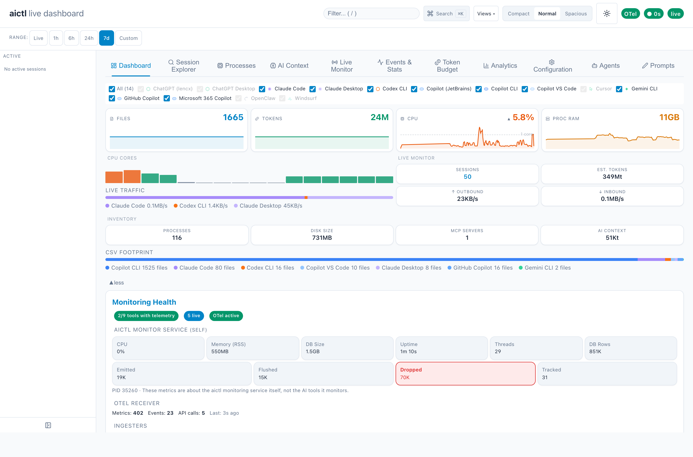
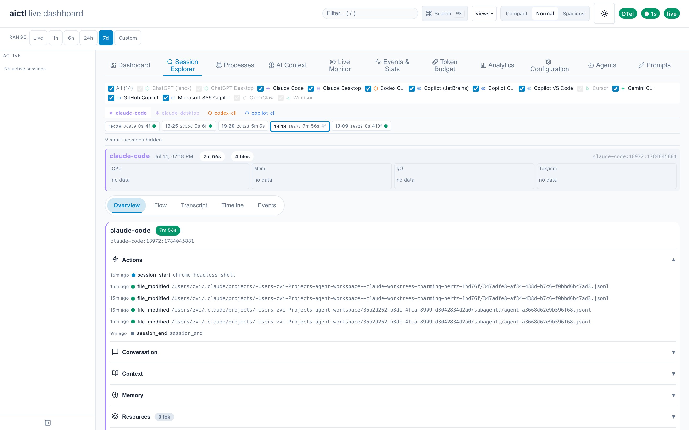
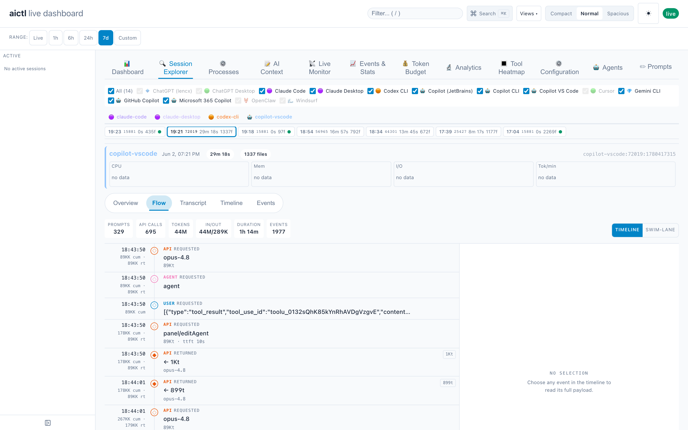
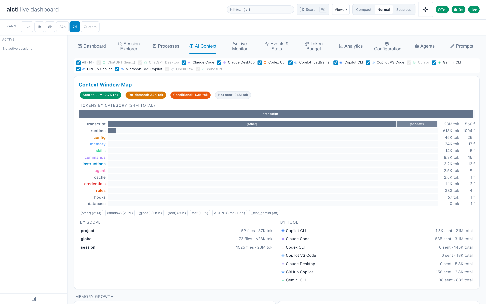

# aictl

**One control plane for every AI coding tool on your machine.**

[](pyproject.toml)
[](#windows-installation--troubleshooting)
[](LICENSE)
[](#how-it-works)

Claude Code, Copilot, Cursor, Codex, Gemini — each with its own instruction
files, MCP servers, hooks, memory, background processes, and token bills.
**aictl** gives you a single place to *define* what they should know and to
*see* what they are actually doing.



*The live dashboard (`aictl daemon serve`): one view across 14 supported
tools — files and token footprint, live sessions and traffic per tool, CPU
and memory, MCP servers, and a Monitoring Health panel that watches the
monitor itself (ingesters, OTel receiver, dropped-sample alerts, data
freshness).*

## Two problems, one tool

**📝 Context control** — write your project's AI context once, in human
terms, in a single `.context.toml`: instructions, commands, skills, MCP
servers, hooks, rules, memory. Then:

- **Deploy** it to every tool's native format (`CLAUDE.md`, Copilot
  instructions, Cursor rules, Windsurf rules, …) with one command
- **Switch by mode** — `debug`, `docs`, `review` profiles each carry their
  own instructions, commands, and agent memory; deploy rotates everything,
  including a profile-aware memory swap
- **Scope by directory** — `.context.toml` files nest; a microservice
  loads only what is relevant to it
- **Import** what you already have — reverse-generate `.context.toml`
  from existing native files, so nothing is lost
- **Package** context as a distributable Claude Code plugin

**🔭 Runtime visibility** — a live local dashboard, TUI, and REST API over
everything the tools do:

- **Sessions** — every session across every tool: duration, tokens, cost,
  files touched, the full conversation, tool calls with their actual
  inputs, process trees, agent teams, and a kill switch for runaways
- **Tokens & cost** — real telemetry (OTel + hooks + session files), daily
  budget charts, per-model breakdowns — with double-counting bugs
  engineered out
- **Processes & MCP servers** — what is running right now, per tool, with
  anomaly detection and cleanup hints
- **Context window map** — which files are loaded into the LLM context,
  token cost per category, sent-to-LLM vs on-demand
- **File history** — every AI-related config/instruction file is content-
  tracked, so you can see when context drifted (secrets are excluded by
  a sensitive-file guard)
- **Self-observability** — the monitor watches itself: ingester health,
  data-quality events, snapshot staleness, dropped samples — a dead
  collector cannot masquerade as "live"

Everything runs locally. No cloud dependency, no accounts, no data leaves
your machine; the dashboard binds to loopback with CORS/CSRF protections.

## Quick Start

```bash
# 1. Install (see Install section for pipx setup)
pipx install "aictl[all] @ git+https://github.com/zvi-code/aictl.git"
# …or from a clone: pipx install ".[all]"

# 2. Start the dashboard (opens your browser)
aictl daemon serve

# 3. Use any AI tool — Claude Code, Copilot, Cursor, Codex, Gemini …
#    Sessions, tokens, processes, and MCP servers appear as they happen.

# 4. Take control of your context
cd my-project
aictl ctx init                      # scaffold .context.toml
aictl ctx deploy --profile debug    # → CLAUDE.md, Copilot rules, Cursor rules, …
```

To connect live AI telemetry (exact token counts, latency, session traces):

```bash
aictl enable                        # one-shot: hooks + OTel + VS Code agent settings
aictl daemon serve                  # now receives OTel from Claude Code, Copilot, Codex
```

Or for the current shell only: `eval $(aictl otel enable --print)`

## Screenshots

### Session Explorer



*Every recorded session, per tool. Pick a session chip to inspect it: live
stats, an action timeline, the captured conversation, loaded context, agent
memory, and resource breakdowns — with Flow, Transcript, Timeline, and
Events sub-views. Short noise sessions are collapsed, not hidden silently.*

### Session Flow



*A sequence diagram reconstructed from structured events: user prompts,
API calls with per-call token counts and models, tool executions, and
subagent spawns.*

### Context Window Map



*What is actually inside the context window: tokens by category (commands,
instructions, skills, rules, memory, …) with per-tool stacked bars and
per-file drill-down.*

## Install

Install globally with [pipx](https://pipx.pypa.io) (recommended — keeps `aictl` isolated from other Python projects):

```bash
# Full install: CLI + web dashboard + TUI + process detection
pipx install --force ".[all]"

# Core CLI only (includes web dashboard — no extra deps needed)
pipx install .
```

> **After updating source code**, reinstall for changes to take effect:
> ```bash
> make install                        # recommended: rebuilds UI + reinstalls
> # or: aictl reinstall               # same thing, from the CLI
> # or: pipx install --force -e ".[all]"  # manual
> ```

### Get pipx

**macOS**
```bash
brew install pipx && pipx ensurepath
```

**Windows** (PowerShell)
```powershell
python -m pip install pipx
python -m pipx ensurepath
# Then restart your terminal so PATH takes effect
```

**Linux**
```bash
pip install --user pipx && pipx ensurepath
```

### Optional extras

The web dashboard (`aictl daemon serve`) works with zero extra dependencies. For the TUI and process detection:

| Extra | Installs | When to use |
|-------|----------|-------------|
| `.[dashboard]` | `textual` | Terminal TUI dashboard (`aictl daemon dashboard`) |
| `.[processes]` | `psutil` | Cross-platform process detection |
| `.[monitor]` | `psutil`, `watchdog` | Live observability (`aictl daemon monitor`) |
| `.[all]` | `textual`, `psutil`, `watchdog` | Recommended for full functionality |

```bash
# Add an extra to an existing install
pipx inject aictl psutil
pipx inject aictl textual
pipx inject aictl watchdog
```

> **Without `psutil`:** process detection falls back to `ps` on macOS/Linux and is silently skipped on Windows.

### Development install

```bash
# Recommended: use make (does everything)
make install          # builds UI + reinstalls Python package

# Or use the CLI command (works even with a stale install):
aictl reinstall       # builds UI + pipx install --force -e ".[all]"
aictl reinstall --skip-ui  # skip the npm build

# Or manually:
pipx install --force -e ".[all]"   # Python only
npm run build --prefix aictl/dashboard/ui  # UI only
```

> **Why is this needed?** `pipx install` copies files into an isolated
> virtualenv. Source edits are not picked up until you reinstall.
> The `-e` (editable) flag avoids this, but `--force` is still required
> to re-register new CLI commands.

> **Tip:** If you get `No such command 'daemon'` after pulling new code,
> run `make install` to rebuild everything.

## How It Works

### Deploy: `.context.toml` → native tool files

```
my-project/
├── .context.toml                    ← root: instructions + commands + skills + MCP + hooks + LSP
├── services/ingestion/.context.toml ← sub-scope: scoped instructions
└── services/query-engine/.context.toml
```

```bash
aictl ctx deploy --root my-project/ --profile debug
```

Generates all native files at the root:

```
my-project/
├── CLAUDE.md                         ← Claude Code base instructions
├── CLAUDE.local.md                   ← profile + agent overlay
├── .claude/rules/services-ingestion.md  ← scoped (glob-matched)
├── .claude/commands/investigate.md   ← slash command
├── .claude/skills/flame-graph/SKILL.md
├── .mcp.json                         ← MCP servers
├── .lsp.json                         ← LSP servers (for plugins)
├── .claude/settings.local.json       ← lifecycle hooks
├── .github/copilot-instructions.md   ← Copilot repo-wide
├── .github/agents/debugger.agent.md  ← Copilot agent
├── .github/prompts/investigate.prompt.md ← VS Code prompt file
├── .cursor/rules/base.mdc            ← Cursor rule
├── .cursor/rules/profile-active.mdc
├── AGENTS.md                         ← Copilot/Cursor profile
└── .ai-deployed/manifest.json        ← tracks files for cleanup
```

Switch profile — old files removed, new files created, memory swapped:

```bash
aictl ctx deploy --root my-project/ --profile docs
```

### Import: native tool files → `.context.toml`

Already have `CLAUDE.md`, `.github/copilot-instructions.md`, or `.cursor/rules/`? Import them into `.context.toml`:

```bash
aictl import --root my-project/
```

Reads native files from all detected tools and generates `.context.toml` files at each relevant directory level:

```
my-project/
├── .context.toml                    ← reconstructed from CLAUDE.md, copilot-instructions.md, etc.
├── services/ingestion/.context.toml ← reconstructed from scoped rules
└── services/query-engine/.context.toml
```

Works with both aictl-generated files (strips deployment markers) and hand-written files. When multiple tools have overlapping content, use `--prefer` to pick the authoritative source:

```bash
aictl import --root . --prefer claude
```

Running `aictl ctx deploy` on the imported `.context.toml` files reproduces the original native files.

### Plugin: package as a Claude Code plugin

Build a distributable Claude Code plugin from your `.context.toml` files:

```bash
aictl plugin build --root my-project/ --name my-plugin --profile debug
```

Generates a complete plugin structure:

```
my-project/plugin/
├── .claude-plugin/plugin.json   ← manifest
├── commands/investigate.md      ← slash commands
├── skills/flame-graph/SKILL.md  ← agent skills
├── agents/debugger.md           ← custom agents
├── hooks/hooks.json             ← lifecycle hooks
├── .mcp.json                    ← MCP servers
├── .lsp.json                    ← LSP servers
└── settings.json                ← default agent
```

Test locally with `claude --plugin-dir ./plugin`, then submit to the plugin marketplace.

### Status: see all AI tool resources

See every file, memory entry, MCP server, and running process across all tools in one view:

```bash
aictl status
```

Discovery is CSV-driven and covers 27+ tools. Use `--tool claude` to filter (expands to all Claude sub-tools), `--processes` for running processes with anomaly detection, `--budget` for token cost analysis, or `--json` for machine-readable output.

```bash
aictl status --processes          # include process detection
aictl status --budget             # token cost breakdown
aictl status --tool copilot       # filter to Copilot tools only
aictl status --json               # full JSON with enriched metadata
aictl status --backtrace 12345    # sample a process stack trace
```

### Monitor: live AI-tool observability

Run a passive, best-effort live monitor for active AI sessions:

```bash
aictl daemon monitor live
```

It is designed for **macOS, Windows, and Linux** and focuses on:

- **VS Code Copilot** / editor-hosted Copilot activity
- **Claude Code**
- **Copilot CLI**
- **Codex CLI**

The monitor correlates:

- **process activity** via `psutil`
- **filesystem activity** via `watchdog`
- **network activity** through platform adapters
- **structured telemetry** when tools expose usage-like logs

It reports traffic, best-effort token estimates with confidence, MCP-style loop detection, and workspace context:

```bash
aictl daemon monitor live --once
aictl daemon monitor live --json
aictl daemon monitor doctor
```

Notes:

- **macOS** uses a `nettop`-backed per-process adapter
- **Linux** uses `ss`/`tcpinfo` deltas as the current fallback path
- **Windows** currently uses a degraded connection-weighted fallback until ETW/WFP bindings are added
- token counts are **signals, not exact billing/accounting**

### OpenTelemetry integration

aictl includes a built-in OTLP HTTP receiver at `/v1/metrics`, `/v1/logs`, and `/v1/traces`. Multiple AI tools can send telemetry simultaneously. The receiver auto-detects the tool from the OTLP `service.name` attribute and supports both JSON and protobuf encoding (with chunked Transfer-Encoding).

**Supported tools:**

| Tool | How to enable | Failure when aictl is down |
|------|--------------|---------------------------|
| **Copilot (VS Code)** | VS Code settings + env vars | `otlp-http` silently fails |
| **Claude Code** | Env vars | Silently drops data |
| **Codex CLI** | `~/.codex/config.toml` `[otel]` section | Silently drops data |

#### Quick setup (all tools at once)

Add to your shell profile (`~/.zshrc`, `~/.bashrc`, etc.):

```bash
# ── aictl: OTel for AI tools ──
export AICTL_PORT=8484
export OTEL_EXPORTER_OTLP_PROTOCOL="http/json"
export OTEL_EXPORTER_OTLP_ENDPOINT="http://localhost:${AICTL_PORT}"
# Claude Code (requires explicit exporter selection)
export CLAUDE_CODE_ENABLE_TELEMETRY=1
export OTEL_METRICS_EXPORTER=otlp
export OTEL_LOGS_EXPORTER=otlp
# VS Code Copilot
export COPILOT_OTEL_ENABLED=true
export COPILOT_OTEL_ENDPOINT="http://localhost:${AICTL_PORT}"
# Codex CLI
export CODEX_OTEL_ENABLED=1
export CODEX_OTEL_ENDPOINT="http://localhost:${AICTL_PORT}"
```

`AICTL_PORT` is the single source of truth — change it once and all tools follow. The `aictl daemon serve`, `aictl otel enable --print`, and `aictl otel status` commands also read `AICTL_PORT` as their default port. If you pass `--port` explicitly and it doesn't match `AICTL_PORT`, aictl warns you.

For **macOS GUI apps** (VS Code launched from Dock/Spotlight), env vars from shell profiles aren't inherited. Set them system-wide:

```bash
launchctl setenv AICTL_PORT 8484
launchctl setenv OTEL_EXPORTER_OTLP_PROTOCOL http/json
launchctl setenv OTEL_EXPORTER_OTLP_ENDPOINT http://localhost:8484
launchctl setenv CLAUDE_CODE_ENABLE_TELEMETRY 1
launchctl setenv COPILOT_OTEL_ENABLED true
launchctl setenv COPILOT_OTEL_ENDPOINT http://localhost:8484
```

Or use `aictl enable` (recommended) to set up everything at once:

```bash
aictl enable                   # hooks + OTel + VS Code agent settings — all tools, all persistent
aictl enable --scope project   # same, but scoped to the current project only
aictl enable --dry-run         # preview what would be written without writing anything
```

`aictl enable` combines `aictl hooks install`, `aictl otel enable`, and VS Code agent/hooks/MCP settings into a single idempotent command. Re-running it is safe — existing content is merged, not overwritten.

> **WriteGuard:** commands that write to existing config files (`enable`, `deploy`, `hooks install`, `otel enable`) prompt for confirmation before modifying each file — `Y` to approve, `A` to approve all remaining, `N` to skip. Pass `--yes` where available or pipe input non-interactively to suppress prompts.

Or use `aictl otel enable` for OTel-only setup:

```bash
aictl otel enable              # all tools — writes shell profiles, VS Code
                               # settings, Codex config, macOS launchctl
aictl otel enable --tool claude  # Claude Code only
```

For one-off shell exports (non-persistent): `eval $(aictl otel enable --print)`.

#### Copilot (VS Code)

In addition to the env vars above, add to VS Code **user settings** (Cmd/Ctrl+Shift+P → "Preferences: Open User Settings (JSON)"):

```json
{
  "github.copilot.chat.otel.enabled": true,
  "github.copilot.chat.otel.exporterType": "otlp-http",
  "github.copilot.chat.otel.otlpEndpoint": "http://127.0.0.1:8484"
}
```

> **Important:** `otlpEndpoint` must NOT include `/v1` — the OTLP SDK appends it automatically. Setting it to `http://127.0.0.1:8484/v1` causes a double-prefix (`/v1/v1/traces`) and silent 404 errors.

Settings Sync will push these to all machines. When aictl isn't running, `otlp-http` silently fails.

VS Code Copilot sends OTLP over HTTP with **chunked Transfer-Encoding**. aictl handles this automatically. The exporter uses protobuf by default; the `OTEL_EXPORTER_OTLP_PROTOCOL=http/json` env var forces JSON encoding (both formats are supported).

#### Claude Code

Claude Code requires **explicit exporter selection** — `CLAUDE_CODE_ENABLE_TELEMETRY=1` alone is not enough. You must also set `OTEL_METRICS_EXPORTER=otlp` and `OTEL_LOGS_EXPORTER=otlp`. The quick setup above includes these. Claude Code defaults to gRPC protocol; the `OTEL_EXPORTER_OTLP_PROTOCOL=http/json` override forces HTTP/JSON which aictl handles natively. Restart Claude Code after setting the env vars.

#### Codex CLI

Env vars work, or configure via TOML:

```toml
# ~/.codex/config.toml
[otel]
enabled = true
endpoint = "http://127.0.0.1:8484"
```

#### Protobuf support

The receiver accepts both JSON (`application/json`) and protobuf (`application/x-protobuf`) OTLP payloads. Protobuf decoding requires the optional `otel` extra:

```bash
pipx inject aictl opentelemetry-proto protobuf
# or: pip install 'aictl[otel]'
```

Without it, protobuf payloads return HTTP 415 with a helpful error message. JSON payloads always work with zero extra dependencies.

#### What OTel provides

All tools export using OpenTelemetry semantic conventions:
- `gen_ai.client.token.usage` — exact input/output token counts per LLM call
- `gen_ai.client.operation.duration` — inference latency
- Tool call metrics — count, duration, tool names
- Agent session metrics — invocation duration, turn count
- Full trace hierarchy: spans with parent-child relationships
- Error tracking: rate limits, timeouts, API errors

See [docs/vscode-otel-raw-output.md](docs/vscode-otel-raw-output.md) for a complete example of raw OTel data from VS Code Copilot.

#### Verify

```bash
aictl daemon serve
# Use any AI tool, then check:
aictl otel status
# Or: curl http://localhost:8484/api/otel-status
# Should show metrics_received > 0 and/or events_received > 0
```

The dashboard Collector Health section shows OTel receiver status — green "OTel active" badge when data is flowing, with per-metric counts and parse error tracking.

### Viewing: three ways to explore

aictl offers three complementary ways to view AI tool resources, from quick terminal checks to full interactive dashboards:

#### 1. Web Dashboard (`aictl daemon serve`) — recommended for exploration

```bash
aictl daemon serve                  # opens browser at http://127.0.0.1:8484
aictl daemon serve --port 9000         # custom port
aictl daemon serve --no-open           # don't auto-open browser
aictl daemon serve --no-monitor        # disable live runtime overlay
```

The web dashboard is a real-time, interactive interface built with Vite + Preact. It auto-updates via Server-Sent Events (with periodic full-snapshot refresh) and layers live monitor data on top of the CSV-driven discovery schema:

- **Overview-first** — all tools shown as collapsed summary cards in a grid. Each card combines CSV-discovered files/processes/MCP state with live monitor signals like session count, traffic rate, token estimates, and MCP-loop inference. Click to expand.
- **Hierarchical files** — expanded tool cards group files by category (instructions, config, rules, commands, skills, memory, transcript). Each category is collapsible with directory grouping.
- **Inline file preview** — click any file to see content inline with line numbers. Small files show fully; large files show a tail preview with "show all (N lines)" to expand. "open in viewer" button for full slide-in panel.
- **Process monitoring** — dedicated Processes tab with processes sorted by memory, visual memory bars, process type grouping, anomaly detection with structured details, zombie risk badges, and cleanup commands with click-to-copy.
- **MCP server status** — connectivity table with live status indicators, CPU/memory per server, transport type, and endpoint.
- **Agent memory browser** — collapsible groups (User Memory, Project Memory, Auto Memory) with click-to-view content.
- **Live Monitor tab** — collector diagnostics (auto-hidden when empty), per-tool sessions, live traffic, token inference confidence, workspace roots, and monitored state paths.
- **Token budget** — context window usage bar, always-loaded/on-demand/cacheable breakdown, daily token usage chart (7-day stacked bar by model), verified token table with cache read/write columns, and per-category/per-tool breakdowns.
- **Events & Stats** — per-tool time series (CPU, memory, tokens, traffic), telemetry KV cards with cache metrics and per-model breakdown, and chronological event feed.
- **Compact number formatting** — all values use standardized formatters (max 3 display digits, compact units: `1.2K`, `45MB`, `0.9KB/s`).
- **Dark/light mode** — auto-detects system preference.
- **No extra dependencies** — uses Python stdlib `http.server`.

REST API for scripting and integration:

```bash
curl http://localhost:8484/api/snapshot     # full JSON snapshot
curl "http://localhost:8484/api/file?path=/path/to/CLAUDE.md"  # file content
curl http://localhost:8484/api/budget       # token cost analysis
curl -N http://localhost:8484/api/stream    # real-time SSE stream
curl http://localhost:8484/api/history      # time-series history (in-memory or ?range=1h|6h|24h|7d)
curl "http://localhost:8484/api/events?tool=claude-code&since=$(date +%s -d '1 hour ago')"  # filtered events
curl "http://localhost:8484/api/samples?metric=aictl.cpu&since=3600"  # Prometheus-style metric samples
```

> The file API only serves files in the discovered resource set — arbitrary paths are rejected with 403.

#### 2. Terminal Dashboard (`aictl daemon dashboard`) — for terminal-only environments

```bash
aictl daemon dashboard           # requires textual: pipx inject aictl textual
aictl daemon dashboard --interval 3    # faster refresh
aictl daemon dashboard --no-monitor    # disable live runtime overlay
```

A Textual-based TUI with live-updating stat cards, per-tool summaries, sparkline CPU/MEM history, and tabbed views:

- **Files tab** — hierarchical tree grouped by tool and category, with token counts. Select a file to see metadata and load content in the File Content tab.
- **File Content tab** — displays actual file contents (with truncation for large files) when a file is selected.
- **Processes tab** — all processes sorted by memory, with process type, anomalies, and tool labels.
- **MCP Servers tab** — status table with color-coded dots.
- **Agent Memory tab** — select an entry to preview content inline.
- **Live Monitor tab** — active tool sessions plus collector health and runtime confidence.

Keybindings: `r` refresh, `p` toggle processes, `f` toggle files, `m` toggle memory, `q` quit.

#### 3. HTML Report (`aictl status --html`) — for sharing and archival

```bash
aictl status --html -o report.html    # generate self-contained HTML
aictl status --html > report.html     # pipe to file
```

A static, self-contained HTML file with embedded CSS/JS — open in any browser, no server needed. Includes expandable file content previews, MCP status table, and agent memory browser. Useful for sharing snapshots with teammates or archiving state.

### Microsoft AI tools: discovery coverage

All viewing commands (`aictl daemon serve`, `aictl status`, `aictl daemon dashboard`) discover artifacts from the full Microsoft AI ecosystem in addition to Claude Code, Cursor, and Windsurf:

| Tool | `--tool` key | What is discovered |
|------|--------------|--------------------|
| **GitHub Copilot** | `copilot` | `.github/copilot-instructions.md`, `.github/agents/*.agent.md`, `.github/prompts/*.prompt.md`, `.github/instructions/*.instructions.md`, `.github/skills/*/SKILL.md`, `.github/hooks/*.json`, `AGENTS.md`, `.copilot-mcp.json`, `.vscode/settings.json`, `.vscode/mcp.json`, `.vscode/extensions.json`, `.devcontainer/devcontainer.json`, Copilot Chat globalStorage, active agent sessions, GitHub CLI config, JetBrains `github-copilot.xml` |
| **Microsoft 365 Copilot** | `copilot365` | `appPackage/manifest.json` (v1.18+), `appPackage/declarativeAgent.json` (v1.6), `appPackage/apiPlugin.json`, `m365agents.yml`, `teamsapp.yml`, `aad.manifest.json`, Teams Toolkit `env/.env.*` files, `.fx/` layout (v4), `M365Copilot.exe` process (UWP/MSIX WebView2 shell), UWP package folder |
| **Semantic Kernel** | `semantic_kernel` | `skprompt.txt` + sibling `config.json` anywhere in tree, `Plugins/`, `sk_plugins/`, `SemanticPlugins/`, `Skills/` directories, `appsettings.json` |
| **Azure PromptFlow** | `promptflow` | `flow.dag.yaml`, `flow.flex.yaml`, `.promptflow/` hidden dirs, global `~/.promptflow/pf.yaml` and connections |
| **Azure AI / azd** | `azure_ai` | `azure.yaml` (azd manifest), `.azure/` env state, `local.settings.json` (Azure Functions), `ai.project.yaml`, global `~/.azd/config.json` |

#### Hidden/config files specific to each Microsoft tool

| Tool | Hidden dirs & config files |
|------|-----------------------------|
| GitHub Copilot | `.copilot/` (config, session-store.db, session-state/, permissions, IDE locks, logs, pkg/), `~/.config/gh/hosts.yml` (CLI auth) |
| M365 Copilot | `.fx/` (Teams Toolkit v4 state), `appPackage/`, `%localappdata%\Packages\Microsoft.MicrosoftOfficeHub_*\` (UWP app data/cache) |
| PromptFlow | `.promptflow/` (connection cache, run metadata) |
| Azure AI | `.azure/` (azd env state — subscription IDs, resource group names) |

### HTML report: static snapshot

Generate a self-contained HTML report with file content previews, MCP connectivity status, and agent memory browser:

```bash
aictl status --html -o report.html --root my-project/
```

The report includes expandable file previews (last 5 lines shown, click to expand full content), colour-coded MCP server status, and tabbed navigation between AI Tools, MCP Servers, and Agent Memory views. Open the file in any browser — no dependencies, dark/light mode adapts automatically.

You can also pipe to stdout: `aictl status --html > report.html`.

## Command Reference

| Command | What it does |
|---------|-------------|
| `aictl ctx init` | Scaffold a starter `.context.toml` in the current directory |
| `aictl ctx init --hooks` | Also generate example Claude Code hook scripts in `.claude/hooks/` |
| `aictl ctx validate` | Lint all `.context.toml` files — check syntax, unknown keys, missing fields |
| `aictl ctx diff` | Dry-run: show what files would change on the next deploy (no writes) |
| `aictl config show` | Print effective aictl configuration (port, tool list, paths) |
| `aictl config init` | Create `config.toml` with defaults if it doesn't exist |
| `aictl ctx scan --root .` | Discover `.context.toml` files, show scope map |
| `aictl ctx deploy --root . --profile debug` | Scan → resolve → emit → cleanup → swap memory |
| `aictl import --root .` | Read native tool files → generate `.context.toml` |
| `aictl plugin build --root . --name my-plugin` | Package `.context.toml` as a Claude Code plugin |
| `aictl status --root .` | Show all resources: files, memory, MCP servers, processes |
| `aictl status --processes` | Include running processes with anomaly detection |
| `aictl status --budget` | Show token cost analysis (always-loaded, on-demand, cacheable) |
| `aictl status --html -o report.html` | Generate self-contained HTML report |
| `aictl status --backtrace PID` | Sample a process stack trace |
| `aictl daemon serve` | Launch live web dashboard with REST API at localhost:8484 |
| `aictl daemon dashboard --root .` | Launch live terminal dashboard (TUI) |
| `aictl enable` | One-shot: install hooks + OTel + VS Code agent settings (all tools, persistent) |
| `aictl enable --scope project` | Same, scoped to current project (`.claude/settings.local.json`, `.vscode/settings.json`) |
| `aictl enable --dry-run` | Preview what `aictl enable` would write without writing anything |
| `aictl hooks install` | Configure Claude Code to push hook events to aictl |
| `aictl hooks uninstall` | Remove aictl hook configuration from Claude Code settings |
| `aictl otel enable` | Persist OTel config: shell profiles, VS Code, Codex, launchctl |
| `aictl otel enable --print` | Print env var exports for eval (current shell only) |
| `aictl otel status` | Check OTel receiver health |
| `aictl memory show --root .` | Show Claude Code auto-memory content |
| `aictl memory stashes --root .` | List per-profile memory stashes |
| `aictl db stats` | Show database size, table row counts, and time range |
| `aictl db compact` | Downsample old data, delete expired rows, reclaim space |
| `aictl db reset` | Delete the history database and initialise a fresh empty one |
| `aictl build-ui` | Build the dashboard frontend (npm install + Vite build) |
| `aictl reinstall` | Rebuild UI + reinstall Python package so code changes take effect |
| `aictl reinstall --skip-ui` | Reinstall Python package only (faster, skips npm build) |

### Import options

| Option | Description |
|--------|-------------|
| `--prefer claude\|copilot\|cursor` | Preferred source when tools have different content for the same scope |
| `--profile NAME` | Override auto-detected profile name |
| `--from claude,copilot,cursor` | Comma-separated list of importers to read from (default: all) |
| `--dry-run` | Show what would be written without writing |

### Plugin build options

| Option | Description |
|--------|-------------|
| `--name NAME` | Plugin name (required, used as namespace for skills) |
| `--profile NAME` | Active profile to include |
| `--output DIR` | Output directory (default: `<root>/plugin`) |
| `--description TEXT` | Plugin description |
| `--version X.Y.Z` | Plugin version (default: 1.0.0) |
| `--author NAME` | Author name |
| `--dry-run` | Show what would be written without writing |

### Status options

| Option | Description |
|--------|-------------|
| `--tool NAME` | Show resources for one tool only (`claude`, `copilot`, `cursor`, `windsurf`, `aictl`, or specific names like `claude-code`, `copilot-vscode`) |
| `--processes` | Detect and display running processes with anomaly flags |
| `--budget` | Show token cost analysis (always-loaded, on-demand, cacheable, compaction-surviving) |
| `--backtrace PID` | Sample a process stack trace (macOS: `sample`, Linux: `eu-stack`/`gdb`; not available on Windows) |
| `--json` | Output as JSON with full metadata (scope, sent_to_llm, loaded_when, etc.) |
| `--html` | Generate self-contained HTML report to stdout |
| `-o FILE` | Write HTML report to file instead of stdout |

### Serve options (`aictl daemon serve`)

| Option | Description |
|--------|-------------|
| `--root DIR` | Root directory to monitor (default: `.`) |
| `--port PORT` | Port to listen on (default: `8484`) |
| `--host HOST` | Host to bind to (default: `127.0.0.1`) |
| `--interval SECS` | Refresh interval in seconds (default: `5`) |
| `--no-open` | Don't auto-open the browser |
| `--no-monitor` | Disable live runtime overlay (process/network/filesystem collectors) |

### Enable options

| Option | Description |
|--------|-------------|
| `--scope user\|project` | `user`: global (default) — `project`: write to `cwd/.claude/` and `.vscode/` |
| `--port PORT` | aictl server port (default: `$AICTL_PORT` or `8484`) |
| `--dry-run` | Show what would be done without writing anything |

### Database options (`aictl db`)

| Option | Description |
|--------|-------------|
| `--db PATH` | Path to SQLite database (default: `~/.config/aictl/history.db`) |

`aictl db reset` accepts `-y` / `--yes` to skip the confirmation prompt.

### Dashboard options (`aictl daemon dashboard`)

| Option | Description |
|--------|-------------|
| `--root DIR` | Root directory to monitor (default: `.`) |
| `--interval SECS` | Refresh interval in seconds (default: `5`) |

## Windows Installation & Troubleshooting

### Prerequisites

- **Python 3.10+** — download from [python.org](https://www.python.org/downloads/) or the Microsoft Store.
  During install, check **"Add Python to PATH"**.
- **pipx** — install via PowerShell:
  ```powershell
  python -m pip install pipx
  python -m pipx ensurepath
  ```
  Restart your terminal after `ensurepath` so the PATH change takes effect.

### Install aictl

```powershell
pipx install --force ".[all]"
```

Verify:

```powershell
aictl --version
```

### Development install / reinstall on Windows

The `Makefile` (and therefore `make install`) is Unix/macOS only — on Windows
use the built-in `aictl reinstall` command instead. After editing source code
or pulling new changes, run it from the repo root to rebuild the dashboard UI
and reinstall the Python package so changes take effect:

```powershell
aictl reinstall              # builds UI (npm) + pipx install --force -e ".[all]"
aictl reinstall --skip-ui    # Python only — skip the npm build (faster)
```

> **Windows self-reinstall:** the running `aictl.exe` cannot overwrite itself
> while it is in use (pip would fail with `WinError 32` and leave a half-removed
> install). On Windows `aictl reinstall` therefore hands the install off to a
> **new console window** that waits for the current `aictl` to exit, performs
> the install, and stays open so you can read the result. The original command
> exits immediately — watch the new window, then run `aictl --version`.

If you don't have a working `aictl` on PATH yet (first install or a broken
install), reinstall manually using `python -m pip` (never the locked
`aictl.exe`):

```powershell
python -m pip install -e ".[all]"             # editable install from the repo root
npm install --prefix src/aictl/dashboard/ui   # one-time, if the UI needs building
npm run build --prefix src/aictl/dashboard/ui
```

> **Requires Node.js/npm** for the UI build step. Without it, use
> `aictl reinstall --skip-ui` (the bundled dashboard assets are reused).

### Config file locations on Windows

`aictl status` discovers config files from the standard Windows locations:

| Tool | Location |
|------|----------|
| Claude Code | `%APPDATA%\Claude\` |
| Claude account | `%APPDATA%\Claude\.claude.json` |
| VS Code settings | `%APPDATA%\Code\User\settings.json` |
| VS Code extensions | `%USERPROFILE%\.vscode\extensions\` |
| Cursor settings | `%APPDATA%\Cursor\User\settings.json` |
| Windsurf / Codeium | `%APPDATA%\Codeium\windsurf\` |
| Copilot sessions | `%APPDATA%\GitHub Copilot\session-state\` |
| GitHub CLI | `%APPDATA%\GitHub CLI\` |
| Azure Developer CLI | `%USERPROFILE%\.azd\` |
| PromptFlow | `%USERPROFILE%\.promptflow\` |

### Known limitations on Windows

| Feature | Status |
|---------|--------|
| File discovery (`status`, `daemon serve`, `daemon dashboard`) | ✅ Full support |
| Deploy (`aictl ctx deploy`) / import / scan | ✅ Full support |
| Web dashboard (`aictl daemon serve`) | ✅ Full support (no extra deps) |
| Process detection | ✅ Requires `psutil` (`pipx inject aictl psutil`) |
| Live TUI dashboard | ✅ Requires `textual` (`pipx inject aictl textual`) |
| HTML report | ✅ Full support |
| `--backtrace PID` | ❌ Not available (uses macOS `sample` / Linux `eu-stack`) |
| `ps` fallback (no psutil) | ❌ Skipped silently — install `psutil` instead |

### Common errors

**`aictl` not found after install**

pipx installs to `%USERPROFILE%\.local\bin`. If that's not on your PATH:

```powershell
python -m pipx ensurepath
# Restart PowerShell / Command Prompt
```

**`The dashboard requires the 'textual' package`**

```powershell
pipx inject aictl textual
# or reinstall with all extras:
pipx install --force ".[all]"
```

**`pipx install` silently skips (already installed)**

Always use `--force` to update an existing install (or use `make install`):

```powershell
pipx install --force ".[all]"
```

**Long paths cause errors**

Windows has a 260-character path limit by default. Enable long paths in PowerShell (as Administrator):

```powershell
Set-ItemProperty -Path "HKLM:\SYSTEM\CurrentControlSet\Control\FileSystem" -Name LongPathsEnabled -Value 1
```

Or via Group Policy: *Computer Configuration → Administrative Templates → System → Filesystem → Enable Win32 long paths*.

### Running tests on Windows

```powershell
python -m pytest test\ -v --ignore=test\e2e --ignore=test\e2e_tools   # unit tests
python -m pytest test\e2e\ -v --timeout=120                            # simulated E2E
python -m pytest test\e2e_tools\ -v --timeout=180                      # real-tool E2E
python test\run.py -v                                                   # legacy integration
```

## Testing

aictl has a three-tier test suite: unit tests (fast, no external deps), simulated E2E tests (real server, synthetic payloads), and real-tool E2E tests (actual Claude/Gemini CLIs).

### Quick reference

```bash
make test          # unit tests only; excludes simulated and real-tool E2E
make test-e2e      # simulated E2E — starts aictl server, posts synthetic data
make test-tools    # real-tool E2E — runs Claude/Gemini CLI, verifies hooks, skips missing tools
make test-docker   # Docker fresh-install integration gate
make test-all      # everything above
```

The Makefile uses `.venv/bin/python` when the repo virtualenv exists; override with `make PYTHON=/path/to/python test` for another environment.

### Reproducing the observability and control checks

Use this sequence after changing storage, hook ingestion, local-store ingesters, Docker packaging, or `.context.toml` deployment behavior:

```bash
# Sanity checks before launching longer commands
pwd
.venv/bin/python -m pytest --version
.venv/bin/python -c "import aictl; from aictl.storage import SCHEMA_VERSION; print(aictl.__file__, SCHEMA_VERSION)"
command -v docker && docker info --format '{{.ServerVersion}}'
command -v claude && claude --version
command -v copilot && copilot --help >/dev/null

# Fast local regression pass for the observability/control substrates
.venv/bin/python -m pytest \
  test/test_storage.py \
  test/test_api_endpoints.py \
  test/test_copilot_session_store_ingester.py \
  test/test_cursor_conversations_ingester.py \
  test/test_deploy.py \
  test/e2e/test_hook_flow.py \
  -q --tb=short --timeout=120

# Full local unit suite, excluding E2E and real-tool tests
make test

# Simulated live-server E2E
make test-e2e

# Fresh-install Docker validation
make test-docker
```

Success means all commands exit 0 and these behaviors are specifically covered:

- `HistoryDB.stats()` reports the current `SCHEMA_VERSION`, plus `file_write_events` and `data_quality_status` row counts.
- `PostToolUse` write-like hooks (`Write`, `Edit`, `MultiEdit`, `NotebookEdit`) produce rows at `/api/file-writes` with session, tool, operation, path, and source event id.
- Collector and ingester health is queryable from `/api/data-quality`; missing, unreadable, schema-drift, degraded, and ok states are persisted instead of only logged.
- `/api/sessions` distinguishes live `active`, completed `ended`, imported historical `imported`, and unterminated `open` sessions instead of treating every row with no `ended_at` as live.
- `aictl ctx deploy --profile <name>` fails for unknown profiles unless `--allow-empty-profile` is supplied.
- `aictl ctx deploy --strict` fails when the selected emitter cannot represent a selected feature.
- The Docker gate derives the expected schema from `aictl.storage.SCHEMA_VERSION` and checks current table and column names, so stale schema assumptions fail fast.

Optional real Claude Code check, pinned to the full Haiku model id by default:

```bash
AICTL_CLAUDE_MODEL=claude-haiku-4-5 .venv/bin/python -m pytest test/e2e_tools/test_claude_e2e.py -v --timeout=180
```

Docker real-tool check, when `CLAUDE_CODE_OAUTH_TOKEN` is available:

```bash
CLAUDE_CODE_OAUTH_TOKEN=... AICTL_CLAUDE_MODEL=claude-haiku-4-5 \
  docker compose -f docker/docker-compose.test.yml --profile tools run --build --rm test-claude
```

Optional Copilot CLI smoke, when GitHub Copilot CLI is installed and authenticated:

```bash
copilot --help >/dev/null
copilot -p "Say exactly: AICTL_COPILOT_OK" --output-format json --stream off --no-custom-instructions --disable-builtin-mcps --no-ask-user --deny-tool='*'
```

The first Copilot command is a command-path check; the second is a manual real-service smoke. The automated Copilot coverage in this repo currently focuses on local session-store ingestion.

### Unit tests

```bash
make test                                       # full unit suite
.venv/bin/python -m pytest test/test_dashboard.py -v  # specific module
.venv/bin/python test/run.py                         # legacy integration tests (deploy, import, scan)
```

Coverage includes:
- **SSE↔Snapshot contract** — every `DashboardSnapshot` key must appear in the SSE summary
- **Snapshot aggregation** — computed totals (files, tokens, live sessions, rates)
- **Storage** — SQLite history, metrics, telemetry, events CRUD
- **Monitor** — process classification, network snapshots, collector status
- **WriteGuard** — 48 tests: interactive confirmation, approve-all, abort, non-TTY pass-through
- **Exception discipline** — AST + regex static analysis enforcing no silent exception swallowing
- **Integration** — deploy/import/scan against fixture projects

### Simulated E2E tests (Tier 1)

Starts a real `aictl daemon serve` on a random port and posts synthetic hook/OTel payloads:

```bash
make test-e2e
# or directly:
.venv/bin/python -m pytest test/e2e/ -v --timeout=120
```

Tests cover:
- **Hook flows** — Claude and Gemini hook payloads create sessions and events
- **OTel ingestion** — OTLP metrics, logs, and traces are accepted and stored
- **Session lifecycle** — concurrent sessions, hybrid hook+OTel, event ordering
- **SSE streaming** — live updates arrive via Server-Sent Events

### Real-tool E2E tests (Tier 2)

Runs actual AI tool CLIs in non-interactive mode and verifies hooks fire back to aictl:

```bash
make test-tools
# or directly:
.venv/bin/python -m pytest test/e2e_tools/ -v --timeout=180
```

**Requirements:** Claude Code (`claude`) and/or Gemini CLI (`gemini`) installed and authenticated. Tests that need a missing tool are automatically skipped.

Tests cover:
- **Claude** — JSON output structure, session_id, usage stats, hooks fire, sessions created, tool invocations captured
- **Gemini** — JSON output, response content, session_id, token stats, hooks fire, session end, payload structure

Run only one tool: `pytest test/e2e_tools/ -m tool_gemini` or `pytest test/e2e_tools/ -m tool_claude`

### Docker integration test (fresh-install validation)

Runs aictl in an isolated container with no pre-existing state — validates that a new user's first experience works end-to-end.

```bash
# Install Docker if needed
brew install --cask docker    # macOS
# Then open Docker Desktop from Applications

# Build and run the fresh-install integration gate
make test-docker
# or directly:
docker compose -f docker/docker-compose.test.yml run --build --rm test-integration
```

Tests: CLI boots, fresh DB created with the current schema, deploy produces native files, dashboard responds, OTel is configured, and the schema gate checks the current observability tables. With `CLAUDE_CODE_OAUTH_TOKEN` set, the optional tools profile runs Claude Code with `AICTL_CLAUDE_MODEL=claude-haiku-4-5` by default and verifies telemetry flows into the DB.

```bash
# Run just the dashboard for manual inspection
docker compose -f docker/docker-compose.yml up aictl          # → http://localhost:8484

# Drop into a shell for manual testing
docker compose -f docker/docker-compose.yml run --rm aictl shell
```

See [docker/README.md](docker/README.md) for full details.

### CI

GitHub Actions runs automatically on push/PR (`.github/workflows/test.yml`):
- **Unit tests** — Python 3.11/3.12/3.13 matrix
- **Simulated E2E** — starts server, runs all 40 synthetic tests
- **Docker** — fresh-install validation
- **Nightly** — real-tool E2E with Claude + Gemini (scheduled, opt-in)

## Documentation

| Doc | Contents |
|-----|----------|
| [docs/context.toml-format.md](docs/context.toml-format.md) | Complete `.context.toml` format reference with examples |
| [docs/architecture.md](docs/architecture.md) | Full system architecture — pipeline, monitoring, dashboard, storage, threading |
| [docs/tool-claude-code.md](docs/tool-claude-code.md) | Claude Code: all generated and external files |
| [docs/tool-claude-desktop.md](docs/tool-claude-desktop.md) | Claude Desktop: three modes (Chat, Code, Cowork), extensions, VM, disk usage |
| [docs/tool-copilot.md](docs/tool-copilot.md) | Copilot CLI + VS Code + M365 Copilot: instructions, agents, prompts, architecture |
| [docs/tool-cursor.md](docs/tool-cursor.md) | Cursor: .mdc rules, glob scoping, MCP |
| [docs/vscode-claude-modes.md](docs/vscode-claude-modes.md) | Four VS Code session targets: Local, Cloud, Claude Code, Copilot CLI — same model, different harness |
| [docs/memory.md](docs/memory.md) | Memory swap per (root, profile), outside-repo files |
| [docs/storage-schema.md](docs/storage-schema.md) | SQLite schema — sessions, events, requests, samples, file history |
| [docs/datapoint-catalog.md](docs/datapoint-catalog.md) | Every datapoint the dashboard shows: source, query, meaning |
| [docs/dashboard-design-system.md](docs/dashboard-design-system.md) | Dashboard UI design tokens, patterns, accessibility status |


