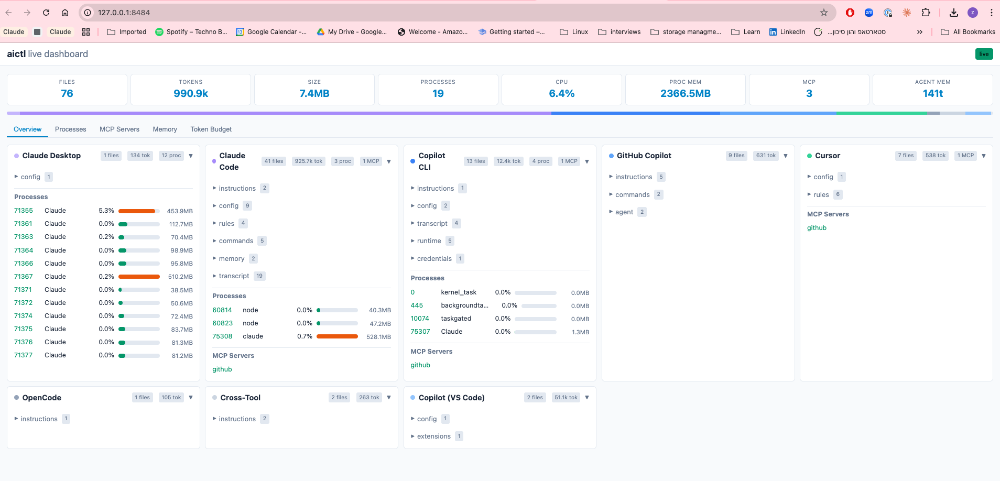

# aictl — One Config for All Your AI Coding Tools

**Claude Code · GitHub Copilot · Cursor · Windsurf · Codex CLI · Gemini CLI · OpenCode** — and [27+ more tools](#supported-tools)

AI coding tools scatter project knowledge across incompatible files — `CLAUDE.md`, `.github/copilot-instructions.md`, `.cursor/rules/`, MCP configs, hooks, memory entries — each duplicated per tool and invisible to the others. The knowledge is the same; only the packaging differs.

**`aictl`** fixes this. Write your AI context once in a single `.aictx` file, then deploy it to every tool. Audit what's already running. Visualize everything in a live dashboard.



<p align="center"><em>Live dashboard (<code>aictl serve</code>) — every AI tool on your system in one view. Files, tokens, processes, CPU, memory, MCP servers, and agent memory across 27+ tools. Real-time updates via SSE.</em></p>

## Quickstart

```bash
# Install
pipx install --force ".[all]"

# See what AI tools are in your project right now
aictl status

# Launch the live web dashboard
aictl serve

# Deploy .aictx to all tools at once
aictl deploy --root . --profile debug
```

## What It Does

### Define once, deploy everywhere

Write a single `.context.aictx` file with instructions, commands, skills, MCP servers, hooks, and scoped rules. Profiles let you switch between modes — debugging, documentation, review — each with its own context and agent memory.

```bash
aictl deploy --root my-project/ --profile debug
```

Generates native files for every tool simultaneously:

```
my-project/
├── CLAUDE.md                          ← Claude Code
├── CLAUDE.local.md                    ← profile overlay + agent memory
├── .claude/commands/investigate.md    ← slash commands
├── .claude/skills/flame-graph/SKILL.md
├── .github/copilot-instructions.md   ← GitHub Copilot
├── .github/agents/debugger.agent.md  ← Copilot agent
├── .cursor/rules/base.mdc            ← Cursor
├── AGENTS.md                          ← Copilot/Cursor profile
├── .mcp.json                          ← MCP servers
└── .ai-deployed/manifest.json         ← tracks files for cleanup
```

Switch profile — old files removed, new files created, memory swapped:

```bash
aictl deploy --root my-project/ --profile docs
```

### Import what you already have

Already have `CLAUDE.md`, `.github/copilot-instructions.md`, or `.cursor/rules/`? Import them:

```bash
aictl import --root my-project/
```

Reads native files from all detected tools and generates `.context.aictx` files. Round-trips cleanly — `aictl deploy` on the imported files reproduces the originals.

### Audit everything

See every file, memory entry, MCP server, and running process across all tools:

```bash
aictl status                    # full inventory
aictl status --processes        # include running processes with anomaly detection
aictl status --budget           # token cost analysis
aictl status --tool claude      # filter to one tool
aictl status --html -o report.html  # shareable HTML report
```

### Visualize

Three ways to explore, from quick terminal checks to full interactive dashboards:


<p align="center"><em>Terminal dashboard (<code>aictl dashboard</code>) — stat cards, sparkline CPU/MEM history, per-tool summaries, and tabbed views for processes, files, MCP servers, and agent memory.</em></p>

| View | Command | Best for |
|------|---------|----------|
| **Web dashboard** | `aictl serve` | Interactive exploration, file inspection, live monitoring |
| **Terminal TUI** | `aictl dashboard` | Terminal-only environments, quick checks |
| **HTML report** | `aictl status --html` | Sharing snapshots, archival |

The web dashboard auto-updates via Server-Sent Events, shows dual signal bars (static footprint vs. live traffic), inline file previews with line numbers, process monitoring with anomaly detection, MCP server connectivity status, agent memory browser, and token budget breakdown. No extra dependencies — uses Python stdlib `http.server`. Dark/light mode auto-detects system preference.

### Monitor live sessions

Run a passive, best-effort live monitor for active AI sessions:

```bash
aictl monitor live
```

Correlates process activity, filesystem changes, network traffic, and structured telemetry across VS Code Copilot, Claude Code, Copilot CLI, and Codex CLI. Reports traffic, token estimates with confidence levels, MCP-loop detection, and workspace context.

### Package as plugins

Bundle `.aictx` into distributable Claude Code plugins:

```bash
aictl plugin build --root my-project/ --name my-plugin --profile debug
```

Test locally with `claude --plugin-dir ./plugin`, then submit to the plugin marketplace.

## The `.aictx` Format

A single `.context.aictx` file captures everything an AI tool needs. Place it in any directory that represents a scope:

```
my-project/
├── .context.aictx                          ← root scope
├── services/api/.context.aictx             ← api scope
└── services/worker/.context.aictx          ← worker scope
```

Sections use a simple bracket syntax:

```ini
[base]
# Always-on instructions for all profiles
REST API backed by PostgreSQL. Build: make build. Test: make test.

[debug]
# Profile-specific instructions
Check pod logs first. Common issue: connection pool exhaustion.

[command:debug:investigate]
Investigate $ARGUMENTS: check logs, query Grafana, check deployments.

[mcp:_always:github]
{"type": "http", "url": "https://api.githubcopilot.com/mcp/"}

[memory:debug]
The connection pool issue was traced to missing connection timeouts.
```

See the [full format reference](docs/aictx-format.md) for all section types including commands, agents, skills, hooks, LSP servers, inheritance, and exclusions.

## Supported Tools

`aictl` discovers and manages resources across the full AI coding tool ecosystem:

| Tool | Key | What's managed |
|------|-----|----------------|
| **Claude Code** | `claude` | `CLAUDE.md`, rules, commands, skills, hooks, MCP, memory, transcripts |
| **Claude Desktop** | `claude-desktop` | Config, sessions, agent memory |
| **GitHub Copilot** | `copilot` | Instructions, agents, prompts, skills, hooks, MCP, sessions |
| **Copilot CLI** | `copilot-cli` | Instructions, config, skills, transcripts, runtime, credentials |
| **Copilot VS Code** | `copilot-vscode` | Settings, extensions, MCP config |
| **Cursor** | `cursor` | Rules (`.mdc`), config, MCP |
| **Windsurf** | `windsurf` | Rules, config, memory |
| **Codex CLI** | `codex-cli` | Instructions, config, runtime |
| **Gemini CLI** | `gemini-cli` | Instructions, config |
| **OpenCode** | `opencode` | Instructions |
| **M365 Copilot** | `copilot365` | Declarative agents, API plugins, Teams manifests |
| **Semantic Kernel** | `semantic_kernel` | Prompts, plugins, skills |
| **Azure PromptFlow** | `promptflow` | Flows, connections |
| **Azure AI / azd** | `azure_ai` | Manifests, env state, functions config |

Plus shared instructions, project environment files, and cross-tool resources.

## Install

Install globally with [pipx](https://pipx.pypa.io) (recommended — keeps `aictl` isolated from other Python projects):

```bash
# Full install: CLI + web dashboard + TUI + process detection
pipx install --force ".[all]"

# Core CLI only (includes web dashboard — no extra deps needed)
pipx install .
```

<details>
<summary><b>Get pipx</b></summary>

**macOS:** `brew install pipx && pipx ensurepath`

**Windows (PowerShell):**
```powershell
python -m pip install pipx
python -m pipx ensurepath
# Restart your terminal so PATH takes effect
```

**Linux:** `pip install --user pipx && pipx ensurepath`

</details>

<details>
<summary><b>Optional extras</b></summary>

The web dashboard (`aictl serve`) works with zero extra dependencies. For the TUI and process detection:

| Extra | Installs | When to use |
|-------|----------|-------------|
| `.[dashboard]` | `textual` | Terminal TUI dashboard (`aictl dashboard`) |
| `.[processes]` | `psutil` | Cross-platform process detection |
| `.[monitor]` | `psutil`, `watchdog` | Live observability (`aictl monitor`) |
| `.[all]` | `textual`, `psutil`, `watchdog` | Recommended for full functionality |

```bash
# Add an extra to an existing install
pipx inject aictl psutil
pipx inject aictl textual
pipx inject aictl watchdog
```

Without `psutil`: process detection falls back to `ps` on macOS/Linux and is silently skipped on Windows.

</details>

<details>
<summary><b>Development install</b></summary>

```bash
pipx install --force -e ".[all]"    # editable + all extras
```

After updating source code, reinstall for the `aictl` command to pick up changes.

</details>

## Command Reference

| Command | What it does |
|---------|-------------|
| `aictl deploy --root . --profile debug` | Deploy `.aictx` → native files for all tools |
| `aictl import --root .` | Import native tool files → `.context.aictx` |
| `aictl status` | Show all resources: files, memory, MCP servers, processes |
| `aictl serve` | Launch live web dashboard at `localhost:8484` |
| `aictl dashboard` | Launch terminal TUI dashboard |
| `aictl monitor live` | Live AI-tool session monitoring |
| `aictl plugin build --root . --name NAME` | Package `.aictx` as Claude Code plugin |
| `aictl scan --root .` | Discover `.aictx` files, show scope map |
| `aictl memory show --root .` | Show Claude Code auto-memory content |

<details>
<summary><b>All CLI options</b></summary>

**Deploy options:** `--root DIR`, `--profile NAME`

**Import options:** `--prefer claude|copilot|cursor`, `--profile NAME`, `--from claude,copilot,cursor`, `--dry-run`

**Status options:** `--tool NAME`, `--processes`, `--budget`, `--backtrace PID`, `--json`, `--html`, `-o FILE`

**Serve options:** `--root DIR`, `--port PORT` (default: 8484), `--host HOST`, `--interval SECS`, `--no-open`, `--no-monitor`

**Dashboard options:** `--root DIR`, `--interval SECS`, `--no-monitor`

**Plugin options:** `--name NAME`, `--profile NAME`, `--output DIR`, `--description TEXT`, `--version X.Y.Z`, `--author NAME`, `--dry-run`

</details>

## How It Works

`.aictx` files are committed to git and reviewed in PRs. The `.aictx` extension is unrecognized by all AI tools — content only reaches tools after `aictl deploy`. This means your source of truth stays clean and tool-agnostic.

The deploy pipeline: **scan** → **resolve** (merge profiles, inheritance, exclusions) → **emit** (generate native files) → **cleanup** (remove stale files via manifest) → **swap memory** (rotate agent memory per profile).

The discovery engine is CSV-driven and covers 27+ tools, scanning for config files, hidden state directories, memory entries, MCP servers, running processes, and their resource consumption. See [architecture docs](docs/architecture.md) for details.

## Documentation

| Doc | Contents |
|-----|----------|
| [Format Reference](docs/aictx-format.md) | Complete `.aictx` format with all section types and examples |
| [Architecture](docs/architecture.md) | Scanning, resolving, emitting, and memory swap internals |
| [Claude Code](docs/tool-claude-code.md) | All generated and external files for Claude Code |
| [GitHub Copilot](docs/tool-copilot.md) | Copilot CLI + VS Code: instructions, agents, prompts |
| [Cursor](docs/tool-cursor.md) | `.mdc` rules, glob scoping, MCP |
| [Memory](docs/memory.md) | Memory swap per (root, profile), outside-repo files |
| [Windows Guide](SETUP-GUIDE.md) | Windows installation, config paths, troubleshooting |

## Platform Support

Runs on **macOS**, **Windows**, and **Linux**. Python 3.10+. See the [Windows guide](SETUP-GUIDE.md) for platform-specific setup and known limitations.
