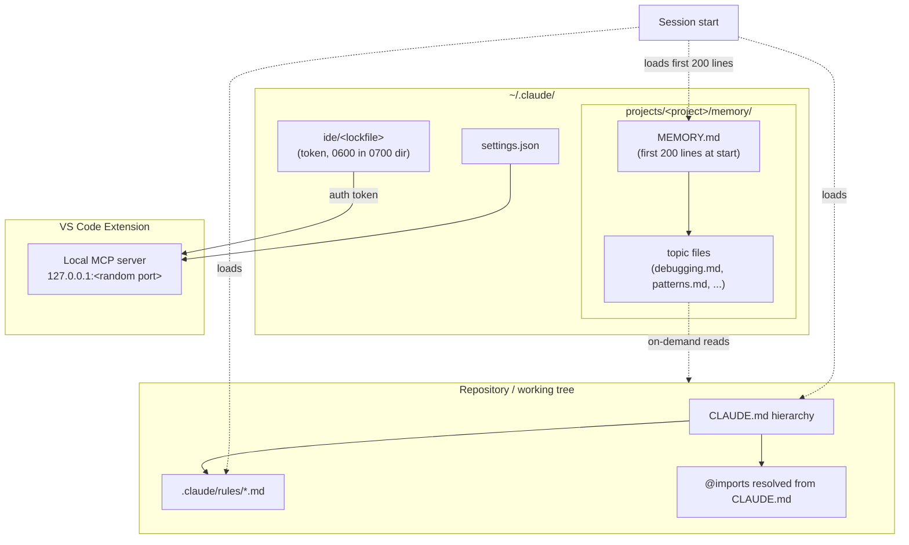
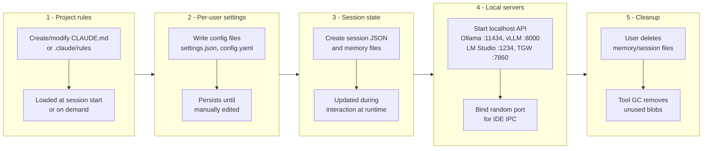

# Low-level artifact and process dossiers for AI coding tools

## Executive summary

Across popular AI coding tools, the most “forensically rich” artifacts typically fall into three buckets: (1) **user-controlled project rules** (e.g., repo-root Markdown instruction files), (2) **per-user configuration/state under a hidden home-directory folder** (often storing credentials, conversation/session metadata, rule bundles, and logs), and (3) **model/runtime caches** (model weights, token/credential caches, prompt/trace caches, and sometimes SQLite or JSON “history” stores).

A few standout patterns matter for low-level operational and forensic analysis:

Claude Code’s *explicit* memory system and its IDE/CLI integration produce unusually concrete on-disk artifacts: `~/.claude/settings.json`, per-repo auto-memory under `~/.claude/projects/<project>/memory/` (with a `MEMORY.md` entrypoint and topic files), and a local IDE MCP server that binds to `127.0.0.1` on a random high port with an auth token stored in a `0600` lock file under `~/.claude/ide/` (directory `0700`).

OpenAI Codex (CLI + IDE extension) similarly documents a clear state root (`CODEX_HOME`, default `~/.codex`) with layered config (`~/.codex/config.toml` plus optional repo-scoped `.codex/config.toml`) and optional history/credential files.

Local LLM runners are split between “**daemonized local HTTP API**” tools (e.g., Ollama on `127.0.0.1:11434`, vLLM on `localhost:8000`, LM Studio typically on `localhost:1234`) and “**web UI hosts**” (e.g., Text Generation WebUI on `127.0.0.1:7860`). These expose predictable local ports, write logs, and often maintain large model stores that persist independently of any one client application.

Frameworks (LangChain/LangServe, LlamaIndex) are usually “**application-defined persistence**”: they offer primitives that write to explicit directories/files you choose (e.g., LangServe examples writing `chat_histories/<id>.json`, LlamaIndex persisting to `./storage` by default), making storage layouts highly dependent on the embedding application.

Cloud providers (OpenAI API, Anthropic API, Gemini API) are largely “**network-defined state**”: the primary observable artifacts are HTTP(S) request/response patterns and remote object lifecycles (e.g., OpenAI `Files` objects and deletion semantics). Offline-forensic focus shifts to local SDK config/secrets, app logs, and any explicit client-side caching (prompt caches, trace caches).

## Methodology, scope, and assumptions

This report prioritizes **official vendor documentation, primary GitHub repositories, and first-party platform docs** for each tool. Where tools explicitly document file paths, directory layouts, locking/token permissions, or startup behavior, those statements are treated as load-bearing.

Because several requested products are cloud-first (and/or closed-source desktop apps), some requested details (exact cache DB names, internal IPC, undisclosed endpoints) are **not specified** in primary sources and are therefore reported as “not documented” rather than inferred. In those cases, you’ll see explicit “documented vs. unspecified” delineation.

All dates are interpreted relative to **2026‑03‑25 (Asia/Jerusalem)** as requested.

## Cross-tool comparative matrix

The table below compares commonly documented artifacts. “State root” means the *documented* canonical directory for tool-owned local state (not counting OS-level app sandbox dirs unless the tool documents them).

| Tool / component | State root / key local paths | Session & memory artifacts | Processes & ports | Security / persistence notes |
|---|---|---|---|---|
| Claude Code (CLI + VS Code extension) | `~/.claude/settings.json` (shared config); auto-memory under `~/.claude/projects/<project>/memory/`; lock/token under `~/.claude/ide/`; project rules via `CLAUDE.md`, `.claude/rules/*.md` | `CLAUDE.md` loaded by directory resolution rules; auto-memory `MEMORY.md` + topic files; `/memory` can browse/edit/delete memory | IDE runs local MCP server bound to `127.0.0.1` on random high port; token in lock file | Lock file permissions are explicitly `0600` inside `0700` dir; auto-memory is machine-local and editable/deletable as plain Markdown |
| OpenAI Codex (CLI + IDE extension) | `CODEX_HOME` (default `~/.codex`); user config `~/.codex/config.toml`; repo config `.codex/config.toml` | Optional `history.jsonl` if enabled; optional `auth.json` if using file-based credential storage | CLI-driven; network to OpenAI API when configured; local-only details beyond config not specified in these docs | Explicit layered configuration; state location documented; credential storage may use OS keychain/keyring instead of files |
| Continue (IDE extensions + `cn` CLI) | User config: `~/.continue/config.yaml` (macOS/Linux), `%USERPROFILE%\.continue\config.yaml` (Windows); optional `config.json`; `config.ts`; rules: `.continue/rules` and `~/.continue/rules`; evidence of `~/.continue/sessions/…json` | Session JSON files under `~/.continue/sessions/…` (observed in issue logs); rules load order documented | Runs as IDE extension (VS Code/JetBrains); local port usage not specified in Continue docs referenced here | Config autogeneration noted; rules can be global/workspace; session folder suggests persistence even when users expect “stateless” behavior |
| VS Code extension platform (baseline for Copilot/Continue/etc.) | Extension authors can store data via `globalState`, `workspaceState`, `storageUri`, `globalStorageUri`, etc. | Persistent key/value state and per-workspace storage are supported by platform | Runs inside VS Code extension host model | Exact on-disk locations are OS/profile-dependent; this row is the conceptual storage surface used by AI extensions |
| GitHub Copilot (VS Code) | Logs stored in the “standard log location” for VS Code extensions (path not enumerated in Copilot doc) | Chat/session persistence location not specified in the cited Copilot troubleshooting docs | Extension network to Copilot; proxy and custom cert support documented | Log collection guidance is explicit; network inspection may require proxy/certs configuration |
| Ollama | Default models path varies: macOS `~/.ollama/models`, Linux `/usr/share/ollama/.ollama/models`, Windows `C:\Users\%username%\.ollama\models`; `OLLAMA_MODELS` overrides; logs on macOS `~/.ollama/logs/server.log` | Model store is split into `blobs` and `manifests` (documented by maintainer comment); server log shows garbage-collection of unused blobs in some scenarios | Local HTTP server default bind `127.0.0.1:11434`; keep-alive controls for model residency | Local logs documented; model storage large and persistent; supports Anthropic-compatible base URL envs for tools expecting Anthropic API (`ANTHROPIC_BASE_URL=http://localhost:11434`) |
| LM Studio | Models under `~/.lmstudio/models/<publisher>/<model>/…gguf`; presets under `~/.lmstudio/config-presets`; hub content under `~/.lmstudio/hub` | Presets are JSON; deletion may leave model folders behind (bug report) | Local OpenAI-compatible and Anthropic-compatible endpoints documented with example port `1234` | Local directories explicitly documented; persistence bug suggests artifacts may remain after “delete” in UI |
| vLLM (OpenAI-compatible server) | No fixed “state root” documented; relies on model source/caches (often HF cache in practice, but not asserted here) | No built-in session store documented in the cited page | HTTP server used via OpenAI client with `base_url="http://localhost:8000/v1"` | Generation defaults can be overridden by `generation_config.json` in HF repos unless disabled |
| Text Generation WebUI (oobabooga) | Repo-local folders: `installer_files` (one-click installer conda env), `user_data/CMD_FLAGS.txt`, `user_data/logs`, `user_data/cache` | Settings may be saved via UI into YAML (documented in discussion/README patterns); one-click reinstall by deleting `installer_files` | Runs local web UI at `http://127.0.0.1:7860` by default; `--listen` and `--listen-port` change exposure | Explicit warning: `--listen` exposes on LAN; “portable builds” and offline stance; API mode available |
| Hugging Face Hub + libraries (huggingface_hub, Transformers, Datasets) | `HF_HOME` default `~/.cache/huggingface`; token default `$HF_HOME/token`; hub cache default `$HF_HOME/hub`; assets/xet caches documented | Token saved to `~/.cache/huggingface/token`; two-tier cache system described (file cache + chunk cache) | Network to HF inference endpoint defaults to `https://api-inference.huggingface.co` (env var); otherwise standard HTTPS | Token path configurable (`HF_TOKEN_PATH`); caches can become large and persist across projects |
| OpenAI API | Remote; local artifacts depend on your client environment | Remote `Files` objects; delete endpoint removes file and from vector stores | REST at `api.openai.com` and supports streaming/realtime per API overview | Prompt caching retention up to 24h (feature doc); local secrets/logs remain user responsibility |
| Anthropic API | Remote; local artifacts depend on client environment | Messages API (`POST /v1/messages`) and optional prompt caching | REST at `api.anthropic.com` | ZDR doc describes prompt caching storing KV cache reps + hashes with 5/60-minute lifetimes; consumer terms update discusses retention choices |
| Gemini API (Google AI for Developers) | Remote; local artifacts depend on client environment | `generateContent` API patterns shown | REST at `generativelanguage.googleapis.com` | Primary forensic artifacts are client logs/secrets unless additional local caching is implemented |
| Jupyter (core) | Config/data directories via environment variables and standard locations | Notebook metadata and per-user config can carry “assistant” traces depending on extensions | Kernel processes per notebook; extension processes depend on JupyterLab/VS Code integrations | Paths are platform- and env-var-driven; treat notebook files themselves as primary persistence layer |
| LlamaIndex (local persistence option) | Default persistence directory `./storage` unless `persist_dir` specified | Index/doc/vector store persistence to chosen dir | In-process library; no ports unless served by your app | Persistence is explicit—indexes can be saved/loaded across runs |
| LangServe / LangChain (typical persistence patterns) | App-defined; example uses `chat_histories/` and JSON files; LangChain cache examples use `.langchain.db` SQLite file | File-based chat histories (`<id>.json`), directory-per-user patterns; cache DB file (`.langchain.db`) | Example server runs via uvicorn and binds `localhost:8000` | Use-case code shows explicit directory creation and identifier sanitization before writing |

## Per-tool dossiers

Below are per-tool “dossiers” focused on file/process structure, inter-file relations, lifecycle, and documented security posture. Where a field is undocumented, it is labeled as such rather than inferred.

**Claude Code (CLI + VS Code extension)**

| Category | Details |
|---|---|
| Primary state roots | User settings shared between CLI/extension in `~/.claude/settings.json`. |
| Project rule surfaces | `CLAUDE.md` is loaded by walking up the directory tree from the working directory; subdirectory `CLAUDE.md` files are lazy-loaded when relevant files are read. Imports via `@path/to/import` are supported (depth limit described). Rules can be placed under `.claude/rules/*.md`. |
| Auto-memory (“machine-local”) | Auto-memory directory defaults to `~/.claude/projects/<project>/memory/` and contains a `MEMORY.md` entrypoint plus topic markdown files; first 200 lines of `MEMORY.md` load at the start of every conversation; topic files are loaded on-demand. Users can edit/delete memory files directly; `/memory` exposes and toggles features. |
| Inter-file relations | `MEMORY.md` functions as an index of topic files; `CLAUDE.md` (and imports/rules) supply instruction context each session, while auto-memory can be read/written during the session. |
| IPC / local services | VS Code extension runs an “IDE MCP server” named `ide`; it binds to `127.0.0.1` on a random high port and uses a fresh random auth token per activation. Token stored in a lock file under `~/.claude/ide/` with `0600` perms in a `0700` dir. |
| Network patterns | By default, connects to Anthropic API; can be configured to use third-party providers (Bedrock/Vertex/Foundry) per docs. |
| Lifecycle notes | Auto-memory is updated when UI indicates “Writing memory” / “Recalled memory”; memory files are plain markdown and persist until edited/deleted by the user. |
| Security notes | Docs explicitly warn about risks of auto-edit permissions (e.g., editing VS Code config files) and recommend Restricted Mode for untrusted workspaces. |

Mermaid relationship diagram (project rules + memory + IDE IPC):



**OpenAI Codex (CLI + IDE extension)**

| Category | Details |
|---|---|
| Primary state root | `CODEX_HOME` defaults to `~/.codex` for local state. |
| Config layering | User config at `~/.codex/config.toml`; project-scoped `.codex/config.toml` supported; CLI defaults inherited from user config; CLI `-c key=value` overrides take precedence per invocation. |
| Credentials | `auth.json` may exist if file-based credentials are used; OS keychain/keyring may be used instead (documented as an alternative). |
| History / logs | `history.jsonl` exists if history persistence is enabled; other logs/caches may exist under `CODEX_HOME` (described generically). |
| Extensibility / interop | Repo and docs mention MCP server configuration via `~/.codex/config.toml`. |
| Network patterns | Uses OpenAI API endpoints when configured; general API docs show `https://api.openai.com/v1/...` usage patterns (Responses API example). |
| Lifecycle notes | Configuration and history persistence are opt-in/out via config keys; deletion semantics for local files depend on the user removing entries under `CODEX_HOME` (no rotation policy is specified in the cited docs). |

**Continue (IDE extension + `cn` CLI)**

| Category | Details |
|---|---|
| Primary state root | Local config stored at `~/.continue/config.yaml` (macOS/Linux) or `%USERPROFILE%\.continue\config.yaml` (Windows). Docs also mention legacy `config.json` and advanced `config.ts` in the same directory. |
| Rules and scoping | Documented rule load order includes workspace rules from `.continue/rules` and global rules from `~/.continue/rules`. |
| Sessions/state | An issue log shows session file loading from `~/.continue/sessions/<uuid>.json` and suggests clearing the sessions folder to resolve issues. |
| Processes | Runs inside IDE extension host; Continue CLI `cn` uses the same config.yaml file. |
| Network patterns | Depends on configured model providers; Continue FAQs show TLS config knobs (e.g., adding `requestOptions.caBundlePath` for custom CAs). |
| Lifecycle notes | Config is created automatically the first time Continue is used and regenerated with defaults if missing (per config guide). Session JSON persistence suggests conversations/metadata remain until cleared. |
| Security notes | Treat `~/.continue/config.yaml` as containing secrets (`apiKey` fields are routine) and apply least-privilege filesystem permissions; Continue documents CA bundle handling for constrained networks. |

**Ollama**

| Category | Details |
|---|---|
| Model store default paths | Documented defaults: macOS `~/.ollama/models`, Linux `/usr/share/ollama/.ollama/models`, Windows `C:\Users\%username%\.ollama\models`. |
| Model store structure | Maintainer comment describes models stored in layers under `~/.ollama/models` with `blobs` and `manifests` directories. |
| Overrides and permissions | `OLLAMA_MODELS` env var changes model location; Windows docs describe setting this env var for model storage relocation. Linux installs may require the `ollama` user to have read/write to the chosen directory. |
| Server bind / port | The `ollama serve --help` output (quoted in community context) and multiple docs use default `127.0.0.1:11434`. |
| Logs | Official troubleshooting doc: macOS log path `~/.ollama/logs/server.log`; on systemd systems logs are accessible via `journalctl -u ollama`. |
| Memory residency controls | API `keep_alive` parameter and `OLLAMA_KEEP_ALIVE` env var control how long models remain loaded in memory; unload by setting keep_alive to `0`. |
| Compatibility modes | Ollama documents Anthropic Messages API compatibility via env vars like `ANTHROPIC_BASE_URL=http://localhost:11434` (token required but ignored). |
| Artifact persistence / GC | Issue evidence shows server reporting “total unused blobs removed,” implying cleanup of unused blobs under some conditions. |

**LM Studio**

| Category | Details |
|---|---|
| Model directory layout | Expected structure: `~/.lmstudio/models/<publisher>/<model>/<model-file.gguf>` (example in docs). |
| Presets/config storage | Presets stored in `~/.lmstudio/config-presets` (macOS/Linux) or `%USERPROFILE%\.lmstudio\config-presets` (Windows). |
| Hub-shared artifacts | Hub shared presets stored in `~/.lmstudio/hub` (macOS/Linux) or `%USERPROFILE%\.lmstudio\hub` (Windows). |
| Local API surface | OpenAI-compatible docs show base URL examples assuming server port `1234` (`http://localhost:1234/v1`). |
| Deletion semantics | Bug tracker report: deleting a model in LM Studio may leave its folder on disk, creating “leftover” artifacts. |
| Security notes | Treat preset JSON and config dirs as potentially containing system prompts, tool choices, and endpoint tokens; local HTTP server exposure depends on binding settings (port and bind host not exhaustively enumerated in cited pages). |

**vLLM (OpenAI-compatible server)**

| Category | Details |
|---|---|
| Local API surface | Docs show OpenAI client configured with `base_url="http://localhost:8000/v1"`, implying default server on port 8000. |
| Supported endpoints | Docs enumerate OpenAI-like paths such as `/v1/chat/completions`, `/v1/completions`, `/v1/embeddings` (and others). |
| Generation defaults | By default, vLLM can apply `generation_config.json` from the model repo if it exists; can disable via `--generation-config vllm`. |
| Persistence | Persistent on-disk state is not described as a vLLM-managed “home”; persistence typically comes from model download caches and your deployment environment (not asserted here beyond docs). |

**Text Generation WebUI (oobabooga)**

| Category | Details |
|---|---|
| Repo-local directories | One-click installer creates a conda env under `installer_files`; user flags in `user_data/CMD_FLAGS.txt`; docker guidance creates `user_data/logs` and `user_data/cache`. |
| Default bind / port | README instructs opening `http://127.0.0.1:7860`; flags include `--listen`, `--listen-port`, `--listen-host`. |
| Settings persistence | Discussion indicates UI “Save settings” writes defaults to `settings.yaml` (pattern referenced by maintainers/community). |
| Lifecycle | README says to reinstall with fresh env, delete `installer_files` and rerun `start_` script; CLI flags can be passed at launch or stored in `CMD_FLAGS.txt`. |
| Security notes | `--listen` makes UI reachable from local network; API mode (`--api`) can expose OpenAI/Anthropic-compatible endpoints; treat as a local service with explicit exposure controls. |

**Hugging Face Hub / huggingface_hub / Transformers / Datasets**

| Category | Details |
|---|---|
| Home & token storage | `HF_HOME` defaults to `~/.cache/huggingface` unless `XDG_CACHE_HOME` is set; token stored at `$HF_HOME/token` by default (e.g., `~/.cache/huggingface/token`). `HF_TOKEN_PATH` overrides token path. |
| Hub cache layout | Hub repos cached at `$HF_HOME/hub` by default; additional caches include `$HF_HOME/assets` and `$HF_HOME/xet`. |
| Cache mechanics & persistence | `huggingface_hub` describes multiple caches (file-based and chunk cache) and provides cache management guidance; datasets doc reiterates default hub cache location. |
| Transformers cache | Transformers docs describe default cache under `~/.cache/huggingface/` (legacy pages also mention `~/.cache/huggingface/transformers/`) and environment variables such as `TRANSFORMERS_CACHE` / `HF_HOME` precedence. |
| Security notes | HF access tokens are plaintext files by default; protecting `HF_HOME` permissions and shell history (when using CLI tokens) is a primary operational control. |

**OpenAI API**

| Category | Details |
|---|---|
| Network base behaviors | API reference describes RESTful plus streaming and realtime APIs; docs show REST calls to `https://api.openai.com/v1/...` such as `/v1/responses`. |
| File objects & deletion | Delete file endpoint: “Delete a file and remove it from all vector stores.” |
| File inputs | Responses API can accept `input_file` items as base64, file IDs (from `/v1/files`), or external URLs. |
| Prompt caching | Prompt caching doc states extended retention up to a maximum of 24 hours. |
| Local artifacts | Local on-disk layout is not specified by OpenAI API docs; local artifacts are primarily SDK config, app logs, and any developer-implemented caches. |

**Anthropic API (Claude)**

| Category | Details |
|---|---|
| Network base behaviors | API overview: REST API at `https://api.anthropic.com`; primary Messages API `POST /v1/messages`. |
| Prompt caching | Prompt caching documentation describes request fields (`cache_control`) for automatic and explicit breakpoints. |
| ZDR constraints | ZDR page describes prompt caching storing KV cache representations and cryptographic hashes; cached entries have at least 5 or 60-minute lifetimes (and are org-isolated) and may be suitable for ZDR commitments because raw text is not stored. |
| Consumer retention option | Anthropic announcement describes retention changing to five years *if* user allows data for model training; otherwise 30-day retention remains. |

**Gemini API (Google AI for Developers)**

| Category | Details |
|---|---|
| Network base behaviors | Docs show REST calls to `https://generativelanguage.googleapis.com/v1beta/models/...:generateContent` with API key headers. |
| Reference surface | Gemini API reference describes standard, streaming, and real-time APIs. |
| Vertex AI variant | Vertex AI documentation covers using Gemini via Google Cloud/Vertex AI (different auth and endpoint context). |
| Local artifacts | As with other cloud APIs, local persistence depends on client apps and SDK logs; no tool-owned local directory layout is described in these API docs. |

**LangChain / LangServe (persistence primitives)**

| Category | Details |
|---|---|
| File-based chat history pattern | LangServe example creates a base directory (e.g., `chat_histories/`), sanitizes identifiers, and writes `file_path = base_dir / f"{id}.json"` (or a per-user subdirectory). |
| Example server port | Example shows `uvicorn.run(... host="localhost", port=8000)`. |
| SQLite caching | LangChain caching examples show `.langchain.db` as the SQLite cache file path. |
| FileChatMessageHistory lifecycle | Source-like doc shows file is created if missing and initialized with an empty JSON list; `clear()` overwrites with `[]`. |

**LlamaIndex (local persistence)**

| Category | Details |
|---|---|
| Default persistence dir | `persist_dir` defaults to `./storage` when persisting storage context. |
| Cross-language parity | TypeScript docs describe local storage via `persistDir: "./storage"` in `StorageContext`. |
| Lifecycle | Persistence is explicit: you call `.persist()`; loading relies on the same directory; multiple indexes may share a dir if tracked by index IDs. |

## Network, IPC, and lifecycle patterns

### Local “coding agent” stack archetype

Many coding assistants follow a layered pattern: editor/CLI frontend → local coordination/IPC → remote model provider (or local model server). Claude Code documents this explicitly: VS Code extension runs a local MCP server on localhost with an auth token written to a lock file.

Local model servers make this pattern observable via stable ports and OpenAI/Anthropic API shims:

Ollama exposes a localhost server (default `127.0.0.1:11434`) and even documents Anthropic-compatible routing via `ANTHROPIC_BASE_URL=http://localhost:11434` to support tools expecting Anthropic endpoints.

vLLM documents OpenAI-client use against `http://localhost:8000/v1`.

LM Studio documents OpenAI compatibility with `http://localhost:1234/v1` (example port).

Text Generation WebUI documents a web UI at `127.0.0.1:7860` and CLI flags to expose it more broadly.

A practical implication is that on a developer workstation you often get **two levels of HTTP**:

1) IDE/CLI ↔ local server (localhost ports, sometimes random high ports for IPC)
2) Local server ↔ model provider (HTTPS to remote API) or local inference backend

### “Memory” lifecycle and rotation behaviors

Tools vary in whether memory artifacts are (a) **first-class, user-editable files** or (b) **opaque internal DBs**:

Claude Code’s auto-memory is plain Markdown (`MEMORY.md` + topic files) and is explicitly user-editable/deletable; the docs also specify what loads at session start (first 200 lines of `MEMORY.md`).

Continue documents config and rules layering, and issue logs reveal JSON session files under `~/.continue/sessions/…`—suggesting persisted state that can be cleared by deleting the sessions folder.

Ollama’s model store lifecycle includes loading/unloading controls (`keep_alive`, `OLLAMA_KEEP_ALIVE`) and documented logs; issue evidence shows removal of “unused blobs,” implying a garbage collection pass affecting on-disk artifacts.

LM Studio shows a counterexample: a reported bug indicates that “delete” in UI may not remove the folder from disk, leaving recoverable artifacts.

OpenAI and Anthropic additionally document “prompt caching” as a performance feature, which is a form of server-side state: OpenAI notes retention up to 24 hours for extended caches; Anthropic ZDR docs describe caching as KV representations + hashes with 5/60-minute lifetime.

Mermaid “lifecycle timeline” (generic but grounded in documented behaviors above):



## Security and forensic persistence considerations

### File permissions, secrets, and least privilege

When tools place auth tokens or sensitive configuration on disk, permissions and directory ACLs become first-order controls. Claude Code is unusually explicit: the IDE MCP auth token is written to a lock file with `0600` permissions in a `0700` directory under `~/.claude/ide/`, and the server binds only to `127.0.0.1` on a random high port (not reachable from other machines).

Hugging Face access tokens are saved by default as plaintext under `HF_HOME` (default `~/.cache/huggingface/token`), and the token path is configurable via `HF_TOKEN_PATH`. Practically, this means workstation compromise or misconfigured home directory permissions can expose both private-model access and any cached gated artifacts.

Continue’s `~/.continue/config.yaml` is a canonical “secrets file” in practice (API keys for model providers), and Continue docs describe TLS certificate bundle configuration in that file—making it a junction point for both authentication and network trust settings.

### Forensic artifact persistence and recoverability

A repeated theme in primary sources is that “delete” is not always “delete from disk”:

LM Studio bug reports indicate model folders can remain after deletion from the UI, leaving remnants on disk that are discoverable by standard filesystem forensics.

Ollama’s blob/manifest split and the “unused blobs removed” behavior means *some* cleanup may be automated, but large amounts of model data and logs can remain. The macOS log file `~/.ollama/logs/server.log` is explicitly documented, which is a durable trace point unless rotated/cleared by the user.

Text Generation WebUI explicitly concentrates user state under `user_data/` (and installer state under `installer_files/`), making it straightforward to set forensic scope—unless the user relocates or deletes these.

LangServe/LangChain examples show that developer-written code often creates and persists chat histories as JSON files in project-relative directories like `chat_histories/`, and these files will frequently contain sensitive prompt contents verbatim.

### Network traffic inspection and endpoint stability

For cloud APIs, the most stable “low-level” truth is the documented base URL + path, plus whether the platform supports streaming/realtime.

OpenAI’s API reference documents `/v1/responses` and other REST endpoints under `api.openai.com`, and the reference explicitly covers REST, streaming, and realtime modes.

Anthropic’s API overview documents `https://api.anthropic.com` and the Messages API at `POST /v1/messages`.

Gemini API docs show calls to `https://generativelanguage.googleapis.com/v1beta/models/...:generateContent`.

For “Copilot-class” tools, network details are typically higher-level in documentation, but proxy and certificate configuration is explicitly supported, which both enables secure corporate networking and makes TLS inspection possible where policy allows.

## Appendix: explicit assumptions and coverage gaps

Assumptions were minimized by design. Where documentation does not specify (a) exact on-disk path(s), (b) rotation/deletion policies, or (c) fixed IPC endpoints, this report labels those fields “not specified” instead of inferring from OS conventions.

Coverage gaps relative to your requested tool list:

For some requested products (e.g., certain proprietary desktop apps, some IDE copilots outside the specific cited tools, and some “Replit agent” internals), primary sources in this research pass did not document concrete file/process layouts at the level of hidden dirs, caches, logs, or IPC endpoints. The practical workaround—when primary docs are absent—is to treat the **documented extension host storage surfaces** (VS Code extension storage APIs), **documented local integration points** (localhost ports, lock files, config roots), and **documented cache/token roots** (HF cache, tool-specific `~/.<tool>` dirs) as the minimum guaranteed artifact set.


## Appendix: followup on OpenClaw and ecosystem mapping + corrections

**OpenClaw is one of the most structurally interesting tools** in this entire space, especially from a *process / filesystem / agent-runtime* perspective. It sits in a **different architectural class** than most coding tools, so if you’re mapping the ecosystem deeply, it *must* be included.

Below is a **corrected and expanded map**, with focus on:

* low-level **file structures**
* **process / daemon models**
* **memory systems**
* **session vs persistent state**
* **tool chaining + runtime loops**

---

# 1. OpenClaw — the missing piece (and why it matters)

## Core architecture (this is the key distinction)

OpenClaw is not a “tool” — it’s a **persistent agent runtime**.

* Runs as a **long-lived process (daemon-like)**
* Maintains **state across sessions**
* Executes:

  * cron jobs
  * message-triggered flows
  * autonomous loops

➡️ Unlike Claude Code / Cursor:

> OpenClaw “runs continuously… executes scheduled tasks… and responds… without anyone sitting at a keyboard” ([CrewClaw][1])

---

## Filesystem structure (real-world patterns)

### Typical `.openclaw/` layout (observed across repos + community tools)

```
.openclaw/
  ├── config.json
  ├── MEMORY.md
  ├── memory/
  │     ├── 2026-03-01.md
  │     ├── 2026-03-02.md
  ├── skills/
  │     ├── email/
  │     │     ├── SKILL.md
  │     │     └── handler.js
  │     ├── calendar/
  ├── jobs/
  │     ├── cron.yaml
  │     ├── workflows.yaml
  ├── logs/
  ├── state/
  │     ├── active_threads.json
  │     ├── tool_cache.json
```

---

## Memory model (this is where it diverges strongly)

OpenClaw uses **multi-layer persistent memory**:

### 1. `MEMORY.md` (L2/L3 distilled)

* long-term decisions
* preferences
* architectural rules

### 2. `memory/YYYY-MM-DD.md` (L1 episodic)

* daily summaries
* task outcomes
* failures / decisions

➡️ Example from real tooling:

> “`MEMORY.md` = distilled long-term memory… `memory/YYYY-MM-DD.md` = daily summaries” ([Reddit][2])

---

### 3. Active thread state (runtime)

* in-memory context window
* rolling execution plan

From community reverse engineering:

* L3: directives
* L2: distilled knowledge
* L1: active thread

➡️ This is essentially a **hierarchical memory compression system**

---

## Process model

OpenClaw runtime loop:

```
while (true):
  ingest_messages()
  update_context()
  plan_tasks()
  execute_tools()
  persist_outputs()
  update_memory()
  sleep / wait / cron
```

Key features:

* **tool-calling chains**
* **self-reflection loops**
* **sub-agent spawning**

Academic work confirms:

* tool chains
* persistent state
* execution lifecycle hooks ([arxiv.org][3])

---

## Critical design insight

OpenClaw is effectively:

> **A stateful OS-like runtime for LLM agents**

Not:

* a CLI
* not an IDE plugin
* not session-based

---

# 2. Claude Code (contrast — much more constrained)

## Structure

```
.claude/
  settings.json
  CLAUDE.md   ← project manifest
tmp/
  *.claude    ← ephemeral session state
```

## Key properties

* **ephemeral session**
* context = file system + prompt
* no persistent memory by default

➡️ Research confirms:

* uses **manifest files (Claude.md)** to encode behavior and rules ([arxiv.org][4])

---

## Process model

```
user_prompt →
  plan →
  edit files →
  run commands →
  respond →
session ends
```

---

## Key difference vs OpenClaw

| Dimension | Claude Code   | OpenClaw                 |
| --------- | ------------- | ------------------------ |
| Lifetime  | session       | persistent daemon        |
| Memory    | ephemeral     | hierarchical persistent  |
| Execution | user-driven   | autonomous               |
| Files     | project-local | system-level runtime     |
| Scope     | codebase      | entire OS + integrations |

---

# 3. Other tools you likely care about (you were right — many missing)

Here’s a **more complete landscape**, focusing on structure/runtime:

---

## A. Coding-first agents (Claude Code class)

### 1. Cursor

* `.cursor/`
* `.cursor/rules/*.md`
* background LSP + embedding index
* local vector store for context

### 2. GitHub Copilot Workspace / Copilot Chat

* no explicit project dir
* state stored in:

  * VSCode extension storage
  * ephemeral session
* heavy reliance on:

  * AST + LSP
  * server-side inference

### 3. Aider

* `.aider.conf.yml`
* git-driven diff loops
* no persistent memory beyond git history

---

## B. Autonomous agent frameworks (OpenClaw class)

### 1. AutoGPT (classic)

* `ai_settings.yaml`
* `memory/` (vector DB)
* loop-based agent executor

### 2. CrewAI

* agents + tasks + tools
* YAML / Python-defined workflows
* no strict filesystem standard

### 3. LangGraph (LangChain evolution)

* explicit DAG execution
* state = graph nodes + checkpoints
* supports persistence but not opinionated FS

---

## C. Hybrid CLI agents (between Claude Code and OpenClaw)

### 1. OpenAI Codex CLI (new gen)

* `.codex/`
* session logs
* tool execution layer
* still mostly session-based

### 2. Warp AI / terminal copilots

* session state only
* no persistent memory

---

## D. Memory-centric ecosystems (important emerging class)

These try to solve the **OpenClaw problem explicitly**:

### Patterns:

* `MEMORY.md`
* `knowledge graph`
* vector DB + summaries
* ingestion pipelines (e.g. mempiper)

➡️ Trend:

> unifying memory across tools (Claude Code, Cursor, etc.) into OpenClaw-style persistent memory ([Reddit][2])

---

# 4. What you *still might be missing*

These are less obvious but relevant to your depth:

---

## 1. “Gateway daemons” (very important emerging pattern)

Example from community:

* wrap Claude Code / Codex behind:

  * routing layer
  * cron
  * messaging

➡️ Essentially:

```
[Agent Runtime]
   ↓
[Gateway daemon]
   ↓
[Claude Code CLI / Codex]
```

This is how people **turn stateless tools into OpenClaw-like systems**

---

## 2. Skill systems (OpenClaw-specific innovation)

```
skills/
  SKILL.md  ← prompt injection surface (!!)
  handler.js
```

Academic work highlights:

* SKILL.md can be abused for prompt injection
* tool outputs persist across runs ([arxiv.org][5])

---

## 3. Security / process boundaries (under-researched but critical)

OpenClaw exposes:

* filesystem
* network
* credentials

Risks include:

* prompt injection via tools
* token amplification loops
* persistent poisoning

---

# 5. Synthesis (this is the real mental model)

You can now classify ALL tools into 3 layers:

---

## Layer 1 — Stateless assistants

* ChatGPT
* Copilot
* Claude web

➡️ no filesystem, no persistence

---

## Layer 2 — Session-based coding agents

* Claude Code
* Cursor
* Aider
* Codex CLI

➡️ ephemeral + project-scoped

---

## Layer 3 — Persistent agent runtimes

* OpenClaw
* AutoGPT (partially)
* custom gateways

➡️ OS-level + long-lived + memory

---

# Final answer to your question

### Yes — OpenClaw is one of the most important missing tools

Because it introduces:

* **persistent agent runtime**
* **filesystem as memory**
* **cron / daemon behavior**
* **skill/plugin injection layer**
* **multi-source context ingestion**

---

### Other tools I initially under-covered:

* Cursor (rules + embedding index)
* Aider (git-driven agent loop)
* Codex CLI (new OpenAI equivalent)
* CrewAI / LangGraph (execution graph layer)
* gateway wrappers (emerging but critical)

---

If you want, I can go even deeper and:

* reconstruct **actual on-disk layouts for each tool**
* map **IPC / subprocess / tool invocation flows**
* or break down **network traffic patterns (API calls, batching, retries, tool loops)**

That’s where things get really interesting for system-level design.

[1]: https://www.crewclaw.com/blog/openclaw-vs-claude-code?utm_source=chatgpt.com "OpenClaw vs Claude Code: When to Use Which (2026) | CrewClaw"
[2]: https://www.reddit.com/r/openclaw/comments/1r9xhy9/i_built_a_tool_that_imports_your_claude_code/?utm_source=chatgpt.com "I built a tool that imports your Claude Code / Cursor / Copilot history into OpenClaw memory"
[3]: https://arxiv.org/abs/2603.11853?utm_source=chatgpt.com "OpenClaw PRISM: A Zero-Fork, Defense-in-Depth Runtime Security Layer for Tool-Augmented LLM Agents"
[4]: https://arxiv.org/abs/2509.14744?utm_source=chatgpt.com "On the Use of Agentic Coding Manifests: An Empirical Study of Claude Code"
[5]: https://arxiv.org/abs/2603.00902?utm_source=chatgpt.com "Clawdrain: Exploiting Tool-Calling Chains for Stealthy Token Exhaustion in OpenClaw Agents"
